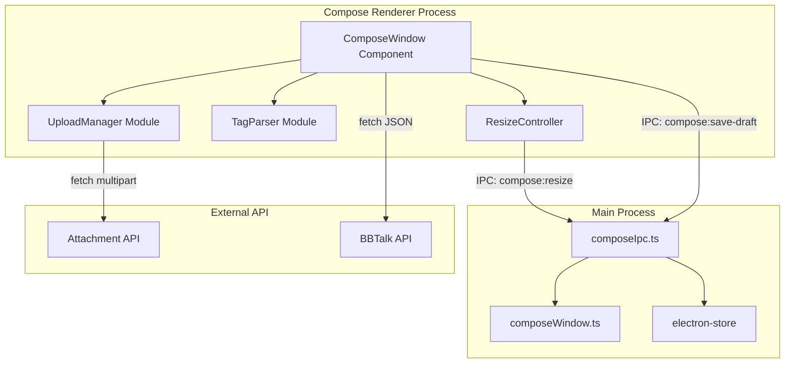
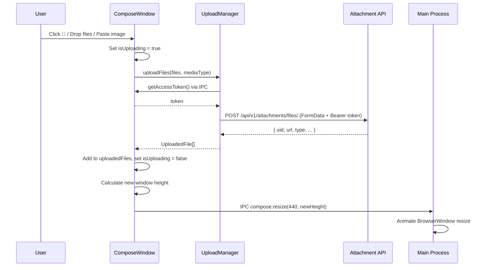
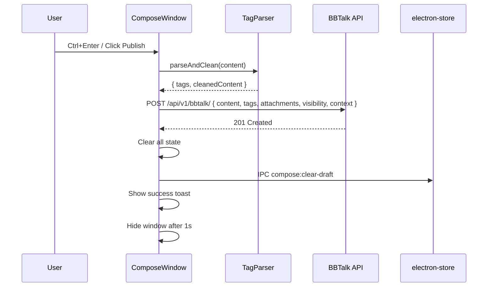
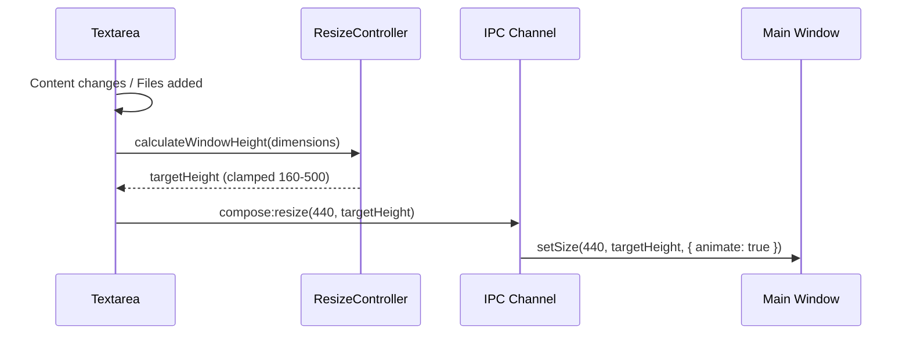

# Design Document: Compose Editor Enhancement

## Overview

This design transforms the desktop Compose window from a minimal textarea-only editor into a rich quick-publish experience matching the web frontend's BBTalkEditor capabilities. The enhancement adds file upload (button, drag-drop, paste), visibility toggling, inline tag parsing, file previews, and dynamic window resizing — all within the compact, frameless, always-on-top BrowserWindow.

The architecture follows the existing Electron IPC pattern: renderer-side logic handles UI state and file uploads directly via `fetch`, while the main process manages window geometry changes via new IPC channels. No new main-process file I/O is needed since uploads go directly to the remote API from the renderer.

## Architecture

### High-Level Architecture



### Design Decisions

1. **Direct fetch from renderer for uploads**: The web frontend already uses `fetch` for file uploads. Since the Compose renderer has network access and the auth token is available via IPC, uploads happen directly from the renderer without proxying through the main process. This avoids complex IPC serialization of file buffers.

2. **Main-process window resize via IPC**: The BrowserWindow can only be resized from the main process. The renderer calculates the desired height and sends it via a new `compose:resize` IPC channel. The main process applies the resize with animation.

3. **Modular decomposition**: Upload logic, tag parsing, and resize calculation are extracted into separate modules for testability and reuse.

4. **Visibility persisted in existing store schema**: The `compose.visibility` field already exists in the electron-store schema, so no migration is needed.

## Components and Interfaces

### New IPC Channels

```typescript
// Added to composeIpc.ts
'compose:resize'        // (width: number, height: number) => void
'compose:get-visibility' // () => 'public' | 'private' | 'friends'
'compose:set-visibility' // (visibility: string) => void
'compose:open-file-dialog' // () => string[] (file paths, for native dialog)
```

### Updated ComposeApi Interface

```typescript
// Added to ipc-types.ts ComposeApi
export interface ComposeApi {
  // ... existing methods ...
  resize(width: number, height: number): Promise<void>;
  getVisibility(): Promise<'public' | 'private' | 'friends'>;
  setVisibility(visibility: 'public' | 'private' | 'friends'): Promise<void>;
  openFileDialog(): Promise<string[]>;
}
```

### UploadManager Module

```typescript
// src/renderer/compose/uploadManager.ts

export interface UploadedFile {
  uid: string;
  url: string;
  type: 'image' | 'video' | 'audio' | 'file';
  name: string;
  mimeType?: string;
  fileSize?: number;
}

export interface UploadState {
  files: UploadedFile[];
  isUploading: boolean;
  error: string | null;
}

export interface UploadManagerApi {
  /** Upload files to the attachment API */
  uploadFiles(files: File[], mediaType?: 'image' | 'auto'): Promise<UploadedFile[]>;
  /** Remove a file from the uploaded list by UID */
  removeFile(uid: string): void;
  /** Get current upload state */
  getState(): UploadState;
  /** Clear all uploaded files */
  clear(): void;
}
```

**Implementation details:**
- Uses `fetch` with `FormData` to POST to `{apiUrl}/api/v1/attachments/files/`
- Auth token retrieved via `window.desktop.auth.getAccessToken()`
- API URL retrieved via `window.desktop.compose.getApiUrl()`
- Classifies files: if MIME starts with `image/` → `media_type: 'image'`, otherwise `'auto'`
- Returns `UploadedFile` with uid, url, type, name from API response

### TagParser Module

```typescript
// src/renderer/compose/tagParser.ts

export interface TagParseResult {
  tags: string[];
  cleanedContent: string;
}

/**
 * Extract tags from content. A tag is defined as:
 * - # followed by non-whitespace characters
 * - Terminated by a space
 * - # must be at start of string or preceded by whitespace/newline
 */
export function parseTags(content: string): string[];

/**
 * Remove #tagname markers from content for publishing.
 * Returns content with all recognized tag patterns stripped.
 */
export function cleanContent(content: string): string;

/**
 * Parse tags and produce cleaned content in one pass.
 */
export function parseAndClean(content: string): TagParseResult;
```

### ResizeController

```typescript
// src/renderer/compose/resizeController.ts

export interface ResizeDimensions {
  textareaHeight: number;   // Current scrollHeight of textarea
  hasFilePreview: boolean;  // Whether file preview area is visible
  filePreviewHeight: number; // Height of file preview area (0 if hidden)
  tagBarHeight: number;     // Height of tag pills bar (0 if no tags)
}

/**
 * Calculate the target window height based on content dimensions.
 * Clamps between MIN_HEIGHT (160) and MAX_HEIGHT (500).
 */
export function calculateWindowHeight(dimensions: ResizeDimensions): number;

export const MIN_WINDOW_HEIGHT = 160;
export const MAX_WINDOW_HEIGHT = 500;
export const MAX_TEXTAREA_HEIGHT = 300;
export const TITLEBAR_HEIGHT = 32;
export const TOOLBAR_HEIGHT = 38;
export const FILE_PREVIEW_HEIGHT = 96; // max height for file preview row
```

### Window Resize (Main Process)

```typescript
// Added to composeWindow.ts

/**
 * Smoothly resize the compose window to the target height.
 * Uses setSize with animation on macOS, step-based on Windows/Linux.
 */
export function resizeComposeWindow(width: number, height: number): void;
```

The resize uses `BrowserWindow.setSize()` with the `animate: true` option on macOS. On Windows/Linux, a small interval-based animation steps the height over ~150ms for smooth transitions.

## Data Models

### Updated Store Schema (no migration needed)

The existing `compose` section in `SettingsSchema` already has:
```typescript
compose: {
  draft: string;
  visibility: 'public' | 'private' | 'friends';
  lastSize: { width: number; height: number } | null;
  outbox: unknown[];
}
```

### Publish Request Body

```typescript
interface PublishPayload {
  content: string;                              // Cleaned content (tags removed)
  tags: string[];                               // Extracted tag names
  attachments: { uid: string }[];               // Uploaded file UIDs
  visibility: 'public' | 'private' | 'friends';
  context: {
    source: {
      client: 'Desktop';
      platform: string; // process.platform via IPC or navigator.platform
    };
  };
}
```

### Component State

```typescript
interface ComposeState {
  content: string;
  visibility: 'public' | 'private' | 'friends';
  uploadedFiles: UploadedFile[];
  isUploading: boolean;
  tags: string[];
  isDragOver: boolean;
  toast: { kind: 'success' | 'error' | 'info'; text: string } | null;
  submitting: boolean;
  loggedIn: boolean | null;
}
```

## Data Flow

### File Upload Flow



### Publish Flow



### Window Resize Flow



## Correctness Properties

*A property is a characteristic or behavior that should hold true across all valid executions of a system — essentially, a formal statement about what the system should do. Properties serve as the bridge between human-readable specifications and machine-verifiable correctness guarantees.*

### Property 1: Tag parsing extracts all embedded tags

*For any* content string containing one or more `#tagname ` patterns (where tagname is non-whitespace and # is preceded by start-of-string or whitespace), the tag parser SHALL extract exactly the set of unique tag names embedded in the content.

**Validates: Requirements 5.1, 5.2, 5.5**

### Property 2: Publish payload includes all state

*For any* compose state with a non-empty content, a set of uploaded files, a set of parsed tags, and a visibility value, the constructed publish payload SHALL contain: the cleaned content, all tag names as an array, all attachment UIDs as an array, and the current visibility value.

**Validates: Requirements 1.6, 4.5, 9.1, 9.2**

### Property 3: Content cleaning removes all tag markers

*For any* content string with embedded `#tagname ` patterns, cleaning the content SHALL produce a string that contains none of the original `#tagname ` markers while preserving all other text.

**Validates: Requirements 5.4**

### Property 4: Visibility cycles correctly

*For any* visibility state in {private, public, friends}, clicking the visibility toggle SHALL produce the next state in the cycle: private → public → friends → private.

**Validates: Requirements 4.1, 4.2**

### Property 5: Visibility persistence round-trip

*For any* visibility value, persisting it to the draft store and then reading it back SHALL produce the same visibility value.

**Validates: Requirements 4.3, 4.4**

### Property 6: Window height clamping invariant

*For any* combination of textarea scroll height (0–∞), file preview visibility (true/false), and tag bar visibility (true/false), the calculated window height SHALL be between MIN_WINDOW_HEIGHT (160) and MAX_WINDOW_HEIGHT (500) inclusive.

**Validates: Requirements 7.3, 7.4**

### Property 7: File type classification

*For any* file with a MIME type, if the MIME type starts with `image/` then the upload request SHALL set `media_type` to `"image"`, otherwise it SHALL set `media_type` to `"auto"`.

**Validates: Requirements 2.4, 1.4**

### Property 8: File removal produces correct list

*For any* list of uploaded files and any file UID in that list, removing that UID SHALL produce a list that does not contain that UID and has length one less than the original.

**Validates: Requirements 6.3**

### Property 9: Post-publish state reset

*For any* pre-publish state (non-empty content, any number of uploaded files, any tags), after a successful publish, the content SHALL be empty, the uploaded files list SHALL be empty, and the tags list SHALL be empty.

**Validates: Requirements 9.4**

## Error Handling

| Scenario | Handling |
|----------|----------|
| Upload network failure | Show toast with error message; keep other files; allow retry via re-selecting |
| Upload 413 (file too large) | Show toast "文件太大，请压缩后重试" |
| Upload auth failure (401) | Show toast; prompt re-login |
| Publish network failure | Show toast with error; keep state for retry |
| Publish 401 | Show login overlay |
| Invalid file type in drop | Silently ignore non-file drag data |
| Window resize fails | Fallback to instant setSize without animation |
| Store read failure | Use defaults (visibility: 'private', empty draft) |

## Testing Strategy

### Property-Based Tests (fast-check)

The project already has `fast-check` as a devDependency. Property tests will use `vitest` + `fast-check`.

- **Tag parser**: Generate random strings with embedded `#tag ` patterns, verify extraction and cleaning
- **Visibility cycle**: Generate random starting states, verify cycle correctness
- **Window height calculation**: Generate random dimension inputs, verify clamping invariant
- **File type classification**: Generate random MIME types, verify correct media_type assignment
- **Publish payload construction**: Generate random compose states, verify payload completeness
- **File removal**: Generate random file lists and removal targets, verify list integrity

Each property test runs minimum 100 iterations and is tagged with:
```
Feature: compose-editor-enhancement, Property {N}: {description}
```

### Unit Tests (vitest)

- Upload manager: mock fetch, verify FormData construction, auth header, error handling
- Drag-drop: verify overlay state transitions (dragenter → show, dragleave → hide, drop → upload)
- Paste handling: verify image extraction, preventDefault behavior, text passthrough
- Resize controller: verify specific dimension scenarios (empty, max content, with/without files)
- Publish flow: mock API, verify request body, state clearing, toast messages

### Integration Tests

- Full compose flow: type content → add tags → upload file → set visibility → publish → verify API call
- Draft persistence: type → close → reopen → verify content and visibility restored
- Window resize: add content → verify IPC resize call with correct dimensions
