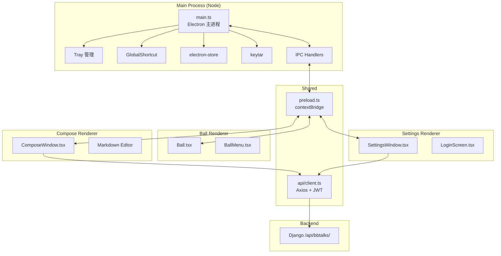

# 技术设计文档：ChewyBBTalk Desktop 悬浮球

## 概述

首版桌面端的核心是"始终悬浮的圆形小球 + 极简编辑窗口"，不承载完整的 BBTalk 浏览能力。技术选型以"开发效率高、生态成熟、跨平台成本低"为主：

- **Electron** 作为容器，处理窗口、托盘、全局快捷键、自动更新。
- **React + Vite + TypeScript** 作为渲染层，复用前端已有组件与风格（Tailwind 主题、MarkdownRenderer）。
- **electron-store** 持久化 Ball 位置与用户偏好。
- **keytar** 保存刷新令牌。
- **electron-builder** 打包分发。

选 Electron 而非 Tauri 的理由：

1. 可以复用 `frontend/src/components` 中已有的 React 组件（尤其是 Markdown 渲染、Editor 初稿），节约实现成本。
2. 后续想把完整 Web 版嵌入（作为一个更大的窗口）成本低。
3. Tauri 的 Webview 在 Windows 上对透明窗口 + 点击穿透的支持不如 Electron 稳定。

## 首版三大体验重点（对齐 requirements.md "核心体验优先级"）

所有实现时间优先级都围绕这三件事排布：

### ① Compose 编辑框——小巧、精致、为 AI 留位

- **默认 440×300**，随内容 3~8 行自适应高到 600px。
- **三层结构**：标题栏（拖动区 + 状态圆点 + 关闭）、主体（textarea + 轻量 Markdown 高亮）、操作栏（AI ✨ / 可见性 / 字数 / 发布）。
- **发布动效**：Toast → 渐隐 textarea → 缩小消失，200ms ease-in 一气呵成。
- **异常恢复**：崩溃后重开自动恢复草稿，底部 1 行提示。
- **AI 扩展点**：底部 ✨ 按钮、`/` 斜杠面板、`AIProvider` 接口、`NoopAIProvider` 实现。

### ② Ball 拖动——60fps 跟手、任何 DPI 不偏移

- `mousemove` 在渲染侧用 `requestAnimationFrame` 节流，IPC 只在每帧末尾发一次。
- 主进程用 `screen.screenToDipPoint` / `dipToScreenPoint` 统一到 DIP 坐标。
- 拖动期间短暂禁用 `alwaysOnTop` 的一些重 composite（如毛玻璃），释放后恢复，进一步降低 GPU 压力。
- 按下缩放反馈、释放回弹动画都使用 CSS transform，只影响 Ball 内部视觉，不动窗口本身。

### ③ Ball 位置——吸边、跨屏、记忆、智能回位

- 每次释放后在当前 `display.workArea` 内判断是否 < 40px，触发吸边。
- 偏好吸附点（需求 2.20）：维护一个 `Map<displayId, Array<{edge, coord, lastUsedAt, hitCount}>>`，同一边缘 hit 次数 ≥3 且坐标方差 < 30px 时升级为 preferred，之后在该边缘 40px 范围内自动吸到偏好点。
- 显示器拔插回位：退出时记录 `display.id`，启动时若该 id 不存在，按相对位置（右下 120px/120px）重建在主屏。
- 屏外纠偏：每次 `screen` 事件（`display-added` / `display-removed` / `display-metrics-changed`）触发 `ensureVisible()`，保证可见面积 ≥ 50%。

## 架构

### 进程划分



所有渲染进程都启用 `contextIsolation: true`、`nodeIntegration: false`，通过 `preload.ts` 暴露白名单 API：

```ts
// preload.ts
contextBridge.exposeInMainWorld('desktop', {
  ball: {
    setPosition: (x: number, y: number) => ipcRenderer.invoke('ball:setPosition', x, y),
    onSnapEdge: (cb: (edge: Edge) => void) => { ... },
  },
  compose: {
    show: () => ipcRenderer.invoke('compose:show'),
    hide: () => ipcRenderer.invoke('compose:hide'),
  },
  auth: {
    getAccessToken: () => ipcRenderer.invoke('auth:getAccessToken'),
    login: (credentials) => ipcRenderer.invoke('auth:login', credentials),
    logout: () => ipcRenderer.invoke('auth:logout'),
  },
  settings: {
    get: () => ipcRenderer.invoke('settings:get'),
    set: (partial) => ipcRenderer.invoke('settings:set', partial),
  },
  shell: {
    openExternal: (url: string) => ipcRenderer.invoke('shell:openExternal', url),
  },
});
```

### 目录结构

```
desktop/
├── package.json
├── tsconfig.json
├── vite.config.ts
├── electron-builder.yml
├── src/
│   ├── main/
│   │   ├── main.ts              # 应用入口
│   │   ├── windows/
│   │   │   ├── ballWindow.ts    # 创建 Ball 窗口
│   │   │   ├── composeWindow.ts
│   │   │   ├── settingsWindow.ts
│   │   │   └── loginWindow.ts
│   │   ├── tray.ts
│   │   ├── hotkey.ts
│   │   ├── auth.ts              # JWT 管理
│   │   ├── store.ts             # electron-store 封装
│   │   ├── ipc.ts               # IPC handler 注册
│   │   └── updater.ts
│   ├── preload/
│   │   └── preload.ts
│   ├── renderer/
│   │   ├── ball/
│   │   │   ├── main.tsx
│   │   │   └── Ball.tsx
│   │   ├── compose/
│   │   │   ├── main.tsx
│   │   │   └── ComposeWindow.tsx
│   │   ├── settings/
│   │   │   ├── main.tsx
│   │   │   └── SettingsWindow.tsx
│   │   ├── login/
│   │   │   └── LoginWindow.tsx
│   │   └── shared/
│   │       ├── api/client.ts
│   │       ├── components/
│   │       └── hooks/
│   └── config/
│       └── ball-menu.ts
└── README.md
```

## 组件与接口

### Ball 窗口

Electron `BrowserWindow` 配置：

```ts
{
  width: 80,         // 冗余 24px 给阴影与动画
  height: 80,
  frame: false,
  transparent: true,
  resizable: false,
  alwaysOnTop: true,
  skipTaskbar: true,
  hasShadow: false,  // 自己渲染阴影，避免平台差异
  focusable: true,
  backgroundColor: '#00000000',
  webPreferences: { preload, contextIsolation: true, nodeIntegration: false },
}
win.setAlwaysOnTop(true, 'screen-saver'); // 确保高于其他 alwaysOnTop 窗口
win.setVisibleOnAllWorkspaces(true, { visibleOnFullScreen: false });
```

#### 拖拽与吸边（**P0 重点，覆盖 requirements 2.3~2.20**）

**核心难点：**

1. **60fps 跟手**：Electron 的 `setPosition` 是跨进程 IPC，每次调用有 1~3ms 开销。直接在每个 `mousemove` 上触发会在高刷新率显示器上掉帧。
2. **高 DPI 坐标转换**：`mousemove` 的 `screenX/screenY` 在 Windows 高缩放下是 DIP，而 `setPosition` 接受物理像素。坐标不一致会出现"拖动时 Ball 漂移"。
3. **跨屏瞬移**：用户把 Ball 从主屏拖到副屏，中间跨越 display 边界的一瞬间容易丢坐标。
4. **吸边智能**：简单的"< 40px 就吸最近边"对用户是生硬的；需要考虑偏好吸附点记忆。

**渲染侧拖动处理（Ball.tsx）：**

```ts
function useBallDrag() {
  const rafRef = useRef<number | null>(null);
  const latestOffset = useRef({ dx: 0, dy: 0 });
  const isDraggingRef = useRef(false);

  const onMouseDown = async (e: MouseEvent) => {
    // 获取按下瞬间窗口位置（主进程侧权威数据）
    const initialWin = await window.desktop.ball.getPosition();
    const startX = e.screenX;
    const startY = e.screenY;
    let moved = false;

    const flushRAF = () => {
      rafRef.current = null;
      if (!isDraggingRef.current) return;
      const { dx, dy } = latestOffset.current;
      // IPC 只在每一帧末尾发一次
      window.desktop.ball.setPosition(initialWin.x + dx, initialWin.y + dy);
    };

    const onMove = (ev: MouseEvent) => {
      const dx = ev.screenX - startX;
      const dy = ev.screenY - startY;
      if (!moved && Math.hypot(dx, dy) > 4) {
        moved = true;
        isDraggingRef.current = true;
        document.body.classList.add('ball-dragging'); // 触发缩放 CSS
      }
      if (!moved) return;
      latestOffset.current = { dx, dy };
      // 合并多次 mousemove 到下一帧
      if (rafRef.current == null) rafRef.current = requestAnimationFrame(flushRAF);
    };

    const onUp = () => {
      document.removeEventListener('mousemove', onMove);
      document.removeEventListener('mouseup', onUp);
      if (rafRef.current != null) cancelAnimationFrame(rafRef.current);
      if (!moved) {
        handleBallClick();
        return;
      }
      isDraggingRef.current = false;
      document.body.classList.remove('ball-dragging');
      // 释放"落地"动画由 CSS 处理；吸边放到主进程
      window.desktop.ball.snapToNearestEdge();
    };

    document.addEventListener('mousemove', onMove);
    document.addEventListener('mouseup', onUp);
  };

  return { onMouseDown };
}
```

关键点：

- **rAF 节流**：每次 `mousemove` 只更新 `latestOffset`，真正的 IPC 调用在下一个 `requestAnimationFrame` 发一次，保证 IPC 调用频率 ≤ 60Hz（高刷显示器会自动对齐到 120Hz）。
- **拖动状态 CSS 类**：按下但未拖动 → `ball-pressed`（缩放 1.05，加投影）；拖动中 → `ball-dragging`（加轻度模糊投影）；释放 → 移除类，触发 `transition: transform 300ms cubic-bezier(0.34,1.56,0.64,1)` 回弹。
- **拖动阈值**：> 4px 才算拖动。这个距离既能过滤用户点击时的微小抖动，又不会让真实拖动有"滞后启动"的感觉。

**主进程坐标转换与 setPosition：**

```ts
// main/windows/ballWindow.ts
import { screen } from 'electron';

ipcMain.handle('ball:setPosition', (_, x: number, y: number) => {
  // 入参 x/y 是 DIP（来自渲染侧 screenX/screenY）。
  // Electron 的 setPosition 在 Linux / Windows 下接受物理像素，
  // 在 macOS 下也是 DIP（Electron 已内部转换）。
  const point = process.platform === 'darwin'
    ? { x, y }
    : screen.dipToScreenPoint({ x, y });
  ballWindow.setPosition(Math.round(point.x), Math.round(point.y), false /* no animate */);
});

ipcMain.handle('ball:getPosition', () => {
  const [px, py] = ballWindow.getPosition();
  const dipPoint = process.platform === 'darwin'
    ? { x: px, y: py }
    : screen.screenToDipPoint({ x: px, y: py });
  return { x: Math.round(dipPoint.x), y: Math.round(dipPoint.y) };
});
```

注意：

- 拖动过程中坚决不用 `animate=true`，否则主进程自带的位置动画会和渲染侧 CSS 变换叠加。
- 跨屏时 `screen.getDisplayMatching` 会返回新的 display，下一帧 `setPosition` 自动落到正确显示器上，不需要特殊处理。

#### 吸边逻辑（主进程，含偏好吸附点）

```ts
interface PreferredSnapPoint {
  edge: 'left' | 'right' | 'top' | 'bottom';
  coord: number;        // 另一轴坐标（靠左/右时记 y，靠上/下时记 x）
  lastUsedAt: number;
  hitCount: number;
}
const preferredByDisplay = new Map<number, PreferredSnapPoint[]>();

function learnSnapPoint(displayId: number, edge: Edge, coord: number) {
  const list = preferredByDisplay.get(displayId) ?? [];
  // 找附近已有点（< 30px 视为同一位置）
  const existing = list.find(p => p.edge === edge && Math.abs(p.coord - coord) < 30);
  if (existing) {
    existing.hitCount += 1;
    existing.coord = (existing.coord + coord) / 2; // 平滑
    existing.lastUsedAt = Date.now();
  } else {
    list.push({ edge, coord, hitCount: 1, lastUsedAt: Date.now() });
  }
  preferredByDisplay.set(displayId, list);
  store.set(`ball.snapPreferred.${displayId}`, list);
}

function findPreferredSnap(displayId: number, edge: Edge, coord: number): number | null {
  const list = preferredByDisplay.get(displayId) ?? [];
  const candidate = list.find(
    p => p.edge === edge && p.hitCount >= 3 && Math.abs(p.coord - coord) < 40,
  );
  return candidate ? candidate.coord : null;
}

ipcMain.handle('ball:snapToNearestEdge', () => {
  const win = ballWindow;
  const [x, y] = win.getPosition();
  const display = screen.getDisplayMatching(win.getBounds());
  const { workArea } = display;
  const [w, h] = win.getSize();

  const rightEdge = workArea.x + workArea.width - w;
  const bottomEdge = workArea.y + workArea.height - h;
  const distances: Record<Edge, number> = {
    left: x - workArea.x,
    right: rightEdge - x,
    top: y - workArea.y,
    bottom: bottomEdge - y,
  };
  const [nearestEdge, nearestDist] = Object.entries(distances)
    .sort(([, a], [, b]) => a - b)[0] as [Edge, number];

  if (nearestDist > 40) {
    ballState.snappedEdge = null;
    savePosition(x, y, display.id);
    return;
  }

  // 偏好吸附点查询（另一轴坐标）
  const axisCoord = (nearestEdge === 'left' || nearestEdge === 'right') ? y : x;
  const preferredCoord = findPreferredSnap(display.id, nearestEdge, axisCoord);
  const snappedAxisCoord = preferredCoord ?? axisCoord;

  let targetX: number, targetY: number;
  switch (nearestEdge) {
    case 'left':   targetX = workArea.x - 28;   targetY = snappedAxisCoord; break;
    case 'right':  targetX = rightEdge + 28;    targetY = snappedAxisCoord; break;
    case 'top':    targetX = snappedAxisCoord;  targetY = workArea.y - 28;   break;
    case 'bottom': targetX = snappedAxisCoord;  targetY = bottomEdge + 28;   break;
  }

  animateSetPosition(win, Math.round(targetX), Math.round(targetY), 300);
  ballState.snappedEdge = nearestEdge;
  learnSnapPoint(display.id, nearestEdge, axisCoord);
  savePosition(targetX, targetY, display.id);
});
```

`animateSetPosition` 是一个自实现的 spring 动画：用 `setInterval(16ms)` 推进，参数 `tension=180 / friction=22`（对齐 React Spring 默认），抵达目标后清理。Electron 自带的 `setPosition(x,y,animate=true)` 在 Windows 上有已知卡顿 bug，不推荐。

#### ensureVisible 与显示器热插拔

```ts
function ensureVisible() {
  const [x, y] = ballWindow.getPosition();
  const [w, h] = ballWindow.getSize();
  const allDisplays = screen.getAllDisplays();
  const contained = allDisplays.some(d =>
    x + w > d.workArea.x + w * 0.5 &&
    x < d.workArea.x + d.workArea.width - w * 0.5 &&
    y + h > d.workArea.y + h * 0.5 &&
    y < d.workArea.y + d.workArea.height - h * 0.5,
  );
  if (!contained) {
    const primary = screen.getPrimaryDisplay().workArea;
    animateSetPosition(
      ballWindow,
      primary.x + primary.width - w - 24,
      primary.y + primary.height - h - 120,
      300,
    );
  }
}

screen.on('display-added', ensureVisible);
screen.on('display-removed', ensureVisible);
screen.on('display-metrics-changed', ensureVisible);
```

吸边状态下露出 28px：Ball 视觉直径 56px，隐藏一半靠窗口越界（`setPosition` 让窗口中心在屏幕外 28px），让系统自动裁剪。窗口本身不缩放 / 不变形。

#### Ball 视觉（CSS 要点）

```css
.ball {
  width: 56px; height: 56px;
  border-radius: 50%;
  background: radial-gradient(circle at 30% 30%, #3B82F6 0%, #2563EB 100%);
  box-shadow:
    0 0 0 2px rgba(255,255,255,0.25) inset,       /* 外圈高光 */
    0 8px 24px rgba(59,130,246,0.35),             /* 主投影 */
    0 2px 6px rgba(0,0,0,0.12);                   /* 桌面投影 */
  color: white;
  display: grid; place-items: center;
  transition: transform 300ms cubic-bezier(0.34, 1.56, 0.64, 1);
  user-select: none;
  cursor: grab;
}
.ball-pressed .ball  { transform: scale(1.05) translateY(1px); }
.ball-dragging .ball { transform: scale(1.05); cursor: grabbing; }
/* 吸边 state：在可见半球上显示主色竖条指示 */
.ball[data-snapped="right"]::after,
.ball[data-snapped="left"]::after {
  content: '';
  position: absolute;
  top: 18px; bottom: 18px;
  width: 4px;
  background: #3B82F6;
  border-radius: 2px;
}
.ball[data-snapped="right"]::after { left: 6px; }
.ball[data-snapped="left"]::after  { right: 6px; }
```

#### 全屏检测

Windows：监听 `powerMonitor` + `BrowserWindow.on('blur')`；更靠谱是用第三方 [node-window-manager](https://github.com/sentialx/node-window-manager) 检测前景窗口是否全屏。macOS 通过 `NSWorkspace` 不易访问，采用 `app.isInApplicationsFolder()` 外加 `screen.getPrimaryDisplay().workAreaSize` 与 `size` 对比近似判断。

为简化首版实现：首版使用"所在 display 的 workAreaSize vs 前台窗口 bounds"近似判断；若检测失败，降级为设置里提供总开关由用户决定。

### Ball_Menu

采用线性下拉（非放射状）便于复用 React 组件：

```tsx
// BallMenu.tsx
const items = useBallMenuConfig(); // 从 config/ball-menu.ts
return (
  <div className="menu" style={{ transformOrigin: menuOrigin }}>
    {items.map(it => (
      <button key={it.id} onClick={it.onClick}>
        <Icon name={it.icon} /> {it.label}
      </button>
    ))}
  </div>
);
```

根据 Ball 当前所靠边缘决定 transform 原点与弹出方向，使用 `ResizeObserver` 动态校正避免溢出。

### Compose_Window（**P0 重点，覆盖 requirements 4.1~4.25**）

#### 窗口配置

```ts
{
  width: 440,
  height: 300,               // 初始高度，随内容生长至 600px
  minHeight: 300,
  maxHeight: 600,
  frame: false,
  transparent: true,         // 允许圆角外阴影；主体内部用毛玻璃背景
  resizable: false,          // 高度由内容决定，不允许手动拉
  alwaysOnTop: true,
  skipTaskbar: false,        // 支持从任务栏唤回
  hasShadow: process.platform !== 'linux', // Linux 阴影异常较多，降级
  roundedCorners: true,       // macOS
  vibrancy: process.platform === 'darwin' ? 'hud' : undefined,
  backgroundMaterial: process.platform === 'win32' ? 'acrylic' : undefined,
  webPreferences: { preload, contextIsolation: true, nodeIntegration: false },
}
```

#### 组件结构

```tsx
// renderer/compose/ComposeWindow.tsx
<div className="compose-root" data-theme={themeName}>
  <header className="compose-titlebar">
    <div className="status-dot" data-state={connectionState} title={stateText} />
    {/* -webkit-app-region: drag 由 CSS 给全局 titlebar，除了下面 close-btn */}
    <button className="close-btn" onClick={minimize} aria-label="最小化">×</button>
  </header>

  <main className="compose-body">
    <GrowingTextarea
      ref={textareaRef}
      value={content}
      onChange={setContent}
      onSlashCommand={handleSlashCommand}   // "/" 触发斜杠命令面板
      placeholder="记一下点什么…"
    />
    <MarkdownOverlay content={content} />   {/* 可切换开关，基础高亮 */}
  </main>

  <footer className="compose-toolbar">
    <div className="tool-icons">
      <AIButton onClick={openAIPanel} />      {/* ✨ 紫色，占位 */}
      <VisibilityToggle value={visibility} onChange={setVisibility} />
      {/* 未来：<TagPicker />, <LocationPicker /> 等 */}
    </div>
    <div className="action-area">
      <span className="char-count">{charCount}</span>
      <PublishButton
        loading={submitting}
        onClick={publish}
        hint="⌘⏎"
      />
    </div>
  </footer>

  <SlashCommandPalette anchor={textareaRef} open={slashOpen} onClose={closeSlash} />
  <AIPanel anchor={aiButtonRef} open={aiOpen} onClose={closeAI} />
</div>
```

#### 视觉规范（Tailwind 或原生 CSS Token）

| Token | 浅色 | 深色 |
|-------|------|------|
| `--bg-surface` | `#FFFFFF` | `#1F2937` |
| `--bg-titlebar` / `--bg-toolbar` | `rgba(255,255,255,0.72)` + backdrop-filter: blur(20px) | `rgba(31,41,55,0.72)` + blur |
| `--text-primary` | `#1F2937` | `#F3F4F6` |
| `--text-placeholder` | `#9CA3AF` | `#6B7280` |
| `--accent` | `#3B82F6` | `#60A5FA` |
| `--accent-pressed` | `#2563EB` | `#3B82F6` |
| `--danger` | `#EF4444` | `#F87171` |
| `--radius-window` | `12px` | — |
| `--radius-button` | `8px` | — |
| `--shadow-window` | `0 20px 60px rgba(0,0,0,0.18)` | `0 20px 60px rgba(0,0,0,0.50)` |
| `--font-body` | `-apple-system, "Segoe UI", "PingFang SC", system-ui, sans-serif` | 同 |
| `--font-size` | `15px` | — |
| `--line-height` | `1.55` | — |

毛玻璃兼容：`backdrop-filter` 在 Electron Chromium 下全平台可用（但 Linux 窗口管理器不一定支持透明度合成），在不支持时自动退化为不透明 surface，仍保留层次感。

#### GrowingTextarea 自适应高度

```tsx
const GrowingTextarea = forwardRef<HTMLTextAreaElement, Props>((props, ref) => {
  const innerRef = useRef<HTMLTextAreaElement>(null);
  useImperativeHandle(ref, () => innerRef.current!);

  useLayoutEffect(() => {
    const el = innerRef.current;
    if (!el) return;
    el.style.height = 'auto';           // 重置以得到真实 scrollHeight
    const nextH = Math.min(el.scrollHeight, MAX_CONTENT_HEIGHT);
    el.style.height = `${nextH}px`;
    // 通知主进程调整窗口高度，自带 160ms 动画
    window.desktop.compose.setContentHeight(nextH);
  }, [props.value]);

  return <textarea ref={innerRef} {...props} className="compose-textarea" />;
});
```

主进程 `setContentHeight` 根据 `nextH` 计算窗口目标高 `36 + nextH + 40`，在 [300, 600] 区间内用 `animateResize` 调整（同 animateSetPosition 的 spring 实现）。

#### 发布动效

```ts
async function publish() {
  setSubmitting(true);
  try {
    await api.createBBTalk({ content, visibility });
    // 1) 底部 Toast 滑入
    showToast({ kind: 'success', text: '已发布' });
    // 2) 等 600ms，textarea 渐隐
    await wait(600);
    setFade(true);
    await wait(300);
    setContent('');
    // 3) 通知主进程缩小并关闭
    window.desktop.compose.closeWithAnimation();
  } catch (err) {
    setSubmitting(false);
    showToast({ kind: 'error', text: formatError(err) });
  }
}
```

`closeWithAnimation` 在主进程侧把窗口用 `setBounds` 做一次 200ms ease-in 的缩放（到 80% 尺寸 + opacity 0），之后 `hide()`（不 `destroy`，保留内存中的 renderer 以便下次秒开）。

#### 斜杠命令与 AI 面板（占位）

```tsx
function useSlashCommands() {
  const [open, setOpen] = useState(false);
  const [query, setQuery] = useState('');

  const onKeyDown = (e: KeyboardEvent) => {
    // 光标所在行 "^/[\w]*$" 时触发
    if (e.key === '/' && isLineStartOrAfterSpace(e.target)) setOpen(true);
    if (e.key === 'Escape' && open) setOpen(false);
  };

  // 首版只返回空命令列表，留下 UI 壳
  const commands: SlashCommand[] = [];

  return { open, query, commands, onKeyDown, close: () => setOpen(false) };
}
```

AI 面板是 240×180 的浮层（`position: fixed` + 锚定于 AIButton 上方），当前只显示占位文案，按设计需求 10 预留 hook。

### 登录与鉴权

主进程 `auth.ts`：

```ts
export async function login(username, password, apiUrl) {
  const { access, refresh } = await http.post(`${apiUrl}/api/auth/token/`, { username, password });
  await keytar.setPassword('chewybbtalk-desktop', 'refresh', refresh);
  store.set('auth.apiUrl', apiUrl);
  store.set('auth.username', username);
  memoryAccessToken = { value: access, exp: decodeExp(access) };
  return { ok: true };
}

export async function getAccessToken(): Promise<string> {
  if (!memoryAccessToken || isNearExpiry(memoryAccessToken, 5 * 60)) {
    const refresh = await keytar.getPassword('chewybbtalk-desktop', 'refresh');
    if (!refresh) throw new AuthError('not-logged-in');
    const { access } = await http.post(`${apiUrl}/api/auth/token/refresh/`, { refresh });
    memoryAccessToken = { value: access, exp: decodeExp(access) };
  }
  return memoryAccessToken.value;
}
```

渲染侧通过 `window.desktop.auth.getAccessToken()` 取 token 后调用 `/api/bbtalks/`。token 绝不进入 localStorage；access token 保存在主进程内存，refresh token 在 keytar。

### 系统托盘

```ts
const tray = new Tray(path.join(__dirname, '../assets/tray-icon.png'));
tray.setToolTip('ChewyBBTalk');
tray.setContextMenu(Menu.buildFromTemplate([
  { label: '新建 (⇧⌘N)', click: () => openComposeWindow() },
  { label: '打开 Web', click: () => shell.openExternal(store.get('webUrl')) },
  { type: 'separator' },
  { label: '显示 / 隐藏 Ball', click: toggleBallVisibility },
  { label: '设置', click: () => openSettingsWindow() },
  { type: 'separator' },
  { label: '关于', click: () => openAboutWindow() },
  { label: '退出', click: () => app.quit() },
]));
tray.on('click', toggleBallVisibility);
```

### 全局快捷键

```ts
// hotkey.ts
const registered: string[] = [];
export function applyHotkeys(config: HotkeyConfig) {
  for (const k of registered) globalShortcut.unregister(k);
  registered.length = 0;

  if (config.toggleBall) {
    globalShortcut.register(config.toggleBall, toggleBallVisibility);
    registered.push(config.toggleBall);
  }
  if (config.newBBTalk) {
    globalShortcut.register(config.newBBTalk, openComposeWindow);
    registered.push(config.newBBTalk);
  }
}
```

冲突处理：`register` 返回 false 时向设置页回显"该快捷键已被占用"。

### Settings_Window

Vite 独立 entry，带 Tabs：通用 / Ball / 快捷键 / 账号 / **AI**（本期灰色占位） / 关于。保存即时生效，通过 IPC 回送主进程并广播到其他渲染进程。

### AI 扩展底座（**覆盖 requirements 10**）

首版不实现任何 AI 调用，只搭好骨架。

#### Provider 接口

```ts
// desktop/src/main/ai/types.ts
export interface AIProvider {
  name: string;                                          // 'noop' | 'openai' | 'ollama' | ...
  summarize(text: string): Promise<string>;
  polish(text: string, tone?: string): Promise<string>;
  continue(text: string): Promise<string>;
  chat(messages: ChatMessage[]): AsyncIterable<string>;  // 流式
  dispose?(): void | Promise<void>;
}

export interface ChatMessage {
  role: 'user' | 'assistant' | 'system';
  content: string;
}
```

#### NoopAIProvider（首版默认）

```ts
// desktop/src/main/ai/noopProvider.ts
export class NoopAIProvider implements AIProvider {
  name = 'noop' as const;
  async summarize() { return 'AI 功能即将上线，摘要暂不可用。'; }
  async polish()    { return 'AI 功能即将上线，润色暂不可用。'; }
  async continue()  { return ''; }
  async *chat()     { yield 'AI 功能即将上线。'; }
}
```

#### IPC 桥接

```ts
// main/ipc.ts
ipcMain.handle('ai:summarize', async (_, text: string) => {
  return currentProvider().summarize(text);
});
ipcMain.handle('ai:polish', async (_, text: string, tone?: string) => {
  return currentProvider().polish(text, tone);
});
ipcMain.handle('ai:continue', async (_, text: string) => {
  return currentProvider().continue(text);
});

// 流式：用 WebContents.send 事件推送 chunk
ipcMain.handle('ai:chat:start', async (e, messages: ChatMessage[]) => {
  const sender = e.sender;
  const streamId = genId();
  (async () => {
    try {
      for await (const chunk of currentProvider().chat(messages)) {
        if (!sender.isDestroyed()) sender.send(`ai:chat:${streamId}:chunk`, chunk);
      }
      sender.send(`ai:chat:${streamId}:end`);
    } catch (err) {
      sender.send(`ai:chat:${streamId}:error`, String(err));
    }
  })();
  return streamId;
});
```

渲染侧的 `useAI()` hook：

```ts
export function useAI() {
  return {
    summarize: (text: string) => window.desktop.ai.summarize(text),
    polish:    (text: string, tone?: string) => window.desktop.ai.polish(text, tone),
    continue:  (text: string) => window.desktop.ai.continue(text),
    chat: (messages: ChatMessage[], onChunk: (c: string) => void, onDone: () => void) => {
      // 基于 ai:chat:start 返回的 streamId 订阅 chunk/end/error 事件
    },
  };
}
```

#### 未来扩展（不做）

- `OpenAIProvider`：fetch `https://api.openai.com/v1/chat/completions`，stream 模式。
- `OllamaProvider`：`http://127.0.0.1:11434/api/chat`，本地模型，无 API Key。
- `BBTalkServerAIProvider`：经后端代理，避免把 API Key 放到桌面端。

切换 provider 通过 Settings "AI" tab 下拉完成，主进程读取 `electron-store` 的 `ai.provider` 字段并懒构造对应实例。

## 数据模型

### electron-store schema

```ts
{
  "auth": {
    "apiUrl": "https://bbtalk.cone387.top",
    "username": "admin"
  },
  "ball": {
    "position": { "x": 1800, "y": 900, "displayId": 1 },
    "snapPreferred": {
      "1": [{ "edge": "right", "coord": 820, "hitCount": 4, "lastUsedAt": 1715130000000 }]
    },
    "size": 56,
    "color": "#3B82F6",
    "hideOnFullscreen": true
  },
  "general": {
    "autoStart": false,
    "notifyOnPublish": true,
    "webUrl": "https://bbtalk.cone387.top"
  },
  "hotkey": {
    "toggleBall": "CommandOrControl+Shift+B",
    "newBBTalk": "CommandOrControl+Shift+N"
  },
  "compose": {
    "draft": "",
    "visibility": "private",
    "lastSize": { "width": 440, "height": 300 },
    "outbox": []         // 离线发送队列，对象列表 { id, content, visibility, createdAt }
  },
  "ai": {
    "provider": "noop",  // noop | openai | ollama | bbtalk-server | custom
    "openaiApiKey": "",  // 预留，首版不使用
    "customEndpoint": ""
  }
}
```

### IPC 消息契约

| Channel | 方向 | Payload | 返回 |
|---------|------|---------|------|
| `ball:setPosition` | R→M | `{ x, y }` | void |
| `ball:getPosition` | R→M | void | `{ x, y }` |
| `ball:snapToNearestEdge` | R→M | void | `{ edge, x, y }` |
| `ball:toggleVisibility` | R→M | void | void |
| `ball:snapStateChanged` | M→R | `{ snappedEdge }` | — |
| `compose:show` | R→M | void | void |
| `compose:setContentHeight` | R→M | `nextH: number` | void |
| `compose:closeWithAnimation` | R→M | void | void |
| `compose:submit` | R→M | `{ content, attachments, visibility }` | `{ ok, error? }` |
| `auth:login` | R→M | `{ username, password, apiUrl }` | `{ ok, error? }` |
| `auth:getAccessToken` | R→M | void | `string` |
| `auth:logout` | R→M | void | void |
| `settings:get` / `settings:set` | R→M | Settings | Settings |
| `shell:openExternal` | R→M | `url` | void |
| `upload:attachment` | R→M | `{ name, type, buffer }` | `{ uid, url }` |
| `ai:summarize` / `ai:polish` / `ai:continue` | R→M | `text` | `string` |
| `ai:chat:start` | R→M | `messages: ChatMessage[]` | `streamId` |
| `ai:chat:{streamId}:chunk` | M→R | `string` | — |
| `ai:chat:{streamId}:end` / `:error` | M→R | void / `err` | — |

## 正确性属性

### Property 1：吸边方向选择

*For any* 窗口位置 `(x, y)` 与显示器工作区，`snapToNearestEdge` 选出的边应当是四个距离中最小且 < 40 的；若没有任一 < 40，则不发生吸附。

**Validates: 需求 2.4, 2.7**

### Property 2：位置持久化往返

*For any* 合法屏幕位置 `(x, y)`（在至少一个 display 工作区内），写入 `store.set('ball.position', ...)` 再读回的结果应恰好相等。

**Validates: 需求 2.8**

### Property 3：快捷键冲突不破坏状态

*For any* 用户输入的快捷键序列（包含可能冲突的），`applyHotkeys` 执行前后 `registered` 列表应与实际 `globalShortcut.isRegistered` 状态一致（即：成功注册的才出现在列表里）。

**Validates: 需求 6.4**

### Property 4：Compose 草稿幂等

*For any* content 字符串 `c`，`store.set('compose.draft', c)` 然后 `store.get('compose.draft')` 应返回完全相同的字符串（不被截断或重编码）。

**Validates: 需求 4.16**

### Property 5：偏好吸附点收敛

*For any* 同一 display、同一 edge、坐标方差 < 30px 的 k 次（k ≥ 3）`learnSnapPoint` 调用序列，之后的 `findPreferredSnap` 查询在该 edge、该坐标附近 40px 范围内应返回一个有限值（即存在偏好点），且返回值与输入坐标均值相差 ≤ 30px。

**Validates: 需求 2.20**

### Property 6：GrowingTextarea 高度单调

*For any* 随内容字符数递增的输入序列 `c₁ ⊂ c₂ ⊂ … ⊂ cₙ`（前者是后者前缀），对应计算出的窗口目标高度 `h₁ ≤ h₂ ≤ … ≤ hₙ ≤ 600`。

**Validates: 需求 4.8**

### Property 7：payload 合法性（发布输入校验）

*For any* 空白字符串（仅空格 / 制表符 / 换行）作为 content，`publish()` 调用应拒绝并不触发 IPC；任何含非空白字符的 content 都应允许发布。

**Validates: 需求 4.9（隐式：内容有效性）**

## 错误处理

| 场景 | 处理 |
|------|------|
| 登录 401 | 主进程 auth 抛 `AuthError`，登录窗口展示"用户名或密码错误" |
| refresh 失败 | 清空 keytar / memoryAccessToken，广播 `auth:loggedOut`，重新弹出登录窗 |
| 网络离线发布 | compose 把条目写入 `compose.outbox`，Toast "已存入离线队列"；网络恢复时由 `netStatusWatcher` 重试 |
| 断网恢复 | `navigator.onLine` 变 true 时自动 flush outbox；每条发送失败保留，UI 显示"未发送条数" |
| 发布鉴权失效 | compose 状态圆点变红，点击直接跳登录；发布请求被挂起直到登录成功 |
| 快捷键冲突 | Settings 显示红色提示 + 回退到默认 |
| 渲染进程崩溃 | 监听 `webContents.on('render-process-gone')`，自动重建 Ball 窗口，保持最近一次位置；Compose 崩溃时下次打开自动从 `compose.draft` 恢复并提示 |
| 主进程未捕获异常 | `process.on('uncaughtException')`：写 `logs/desktop.log`，不退出 |
| 自动更新签名校验失败 | electron-updater 自动拒绝，记录日志；用户手动点"检查更新"再重试 |
| Ball 拖到屏外 / 显示器拔出 | `ensureVisible()` 自动搬回主屏右下 |
| AI 调用失败（未来 provider 生效后） | 返回结果为 `null`，Compose 弹浮层红条"AI 服务暂时不可用" |

## 测试策略

### 属性测试（fast-check，运行在 Node 环境）

| Property | 测试文件 |
|----------|----------|
| P1 吸边方向 | `desktop/src/main/__tests__/snap.property.test.ts` |
| P2 位置持久化 | `desktop/src/main/__tests__/store.property.test.ts` |
| P3 快捷键注册 | `desktop/src/main/__tests__/hotkey.property.test.ts`（mock `globalShortcut`） |
| P4 草稿幂等 | `desktop/src/main/__tests__/draft.property.test.ts` |
| P5 偏好吸附点 | `desktop/src/main/__tests__/snapPreferred.property.test.ts` |
| P6 高度单调 | `desktop/src/renderer/compose/__tests__/height.property.test.ts` |
| P7 输入校验 | `desktop/src/renderer/compose/__tests__/publish.property.test.ts` |

### 单元测试

- `api/client.test.ts`：mock axios，验证 401 自动触发 refresh。
- `BallMenu.test.tsx`：renderer 环境（jsdom）快照。
- `ComposeWindow.test.tsx`：渲染、输入、Ctrl+Enter 触发 submit IPC。

### 手动验证（首版必跑）

| 场景 | 平台 |
|------|------|
| 启动 → Ball 出现在上次位置 | 三端 |
| 拖动 Ball 到屏幕边缘 → 吸附隐藏一半 | 三端 |
| 跨显示器拖动 → 在新显示器内正常吸边 | 三端 |
| 点击 Ball → 菜单弹出方向自适应边缘 | 三端 |
| 双击 Ball → 直接打开 Compose | 三端 |
| Compose 发布成功 → Toast + 关闭 + 系统通知 | 三端 |
| Compose 离线发布 → 错误提示保留内容 | 三端 |
| 全局快捷键 ⇧⌘B / Ctrl+Shift+B 切换 Ball | 三端 |
| 开机启动开启后重启系统 → 自动启动 | 三端 |
| 设置中修改 Ball 尺寸 → 即时生效 | 三端 |
| 退出登录 → 隐藏 Ball + 弹登录窗 | 三端 |
| 托盘图标右键菜单全部可用 | 三端 |

### 性能自测

- 空闲 10 分钟 CPU < 1%（Windows 任务管理器 / macOS Activity Monitor）
- 发布 Compose 端到端 < 1 秒（本地后端）
- 应用启动 → Ball 可点击 < 3 秒

## 后续演进（供你挑选）

以下是一些"可以做得很酷"的方向，供你决定下一期做哪些。首版只做 Ball + 新建 + 跳转 Web，其他都放在 requirements 7.2 的占位里。

### 轻量级（易实现）

1. **最近 5 条 BBTalk 预览**：菜单增一项"最近"，鼠标悬停展开卡片列表，点击在默认浏览器打开对应详情。
2. **贴屏便利贴**：长按 Ball 从内部"拉出"一个纯本地便签，内容与 Compose 共享草稿。
3. **剪贴板监听**：点击菜单"粘贴为 BBTalk"，自动把当前剪贴板文本填入 Compose。
4. **快捷文字片段**：在设置里维护若干 Snippet，Compose 中 `/` 触发下拉插入。
5. **深色模式自动跟随系统**。

### 中量级

6. **截图 → 贴到 BBTalk**：使用 Electron `desktopCapturer` + 系统截图工具（macOS `screencapture`、Windows `SnippingTool`）实现"按住 Ball 滑出截图"，结果直接插入 Compose。
7. **划词保存**：浏览器扩展 + 桌面端协议，选中网页文字右键"加到 BBTalk"，自动带上来源 URL。
8. **番茄钟 / 时间记录**：Ball 点击后可进入"专注模式"，25 分钟结束自动写一条 BBTalk 记录（含时长 / 标签）。
9. **离线队列**：发布失败时进入本地 SQLite 队列，网络恢复自动同步（和 mobile 离线缓存可共享设计）。
10. **多账号切换**：keytar 里存多组 refresh token，菜单里快速切换。

### 重量级（做完等于单独一期）

11. **完整浏览窗口**：点击 Ball 的"展开"图标，唤起一个大窗口嵌入现有前端，桌面端变成 Web 版 + Ball 的组合体。
12. **本地 AI 助写**：接 Ollama / LM Studio 的本地模型，Compose 中 `/ai` 生成摘要或扩写。
13. **OCR 贴图**：截图时自动识别文字填入 Compose。
14. **快捷分享到 BBTalk**（macOS Share Extension / Windows Share Target）：在任意 App 的分享菜单里直接选择 ChewyBBTalk。
15. **Menubar/任务栏 Popover**：macOS 菜单栏点击后弹出一个 360×520 的快速浏览面板，类似 Things 3。

我的建议是先把**剪贴板监听（3）+ 最近 5 条（1）+ 截图贴图（6）** 放在下一期，这三个组合能让这个小工具"真的有用"，而不只是换一个发布入口。
