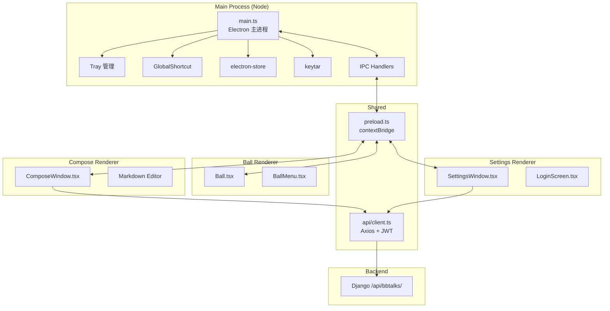

# 技术设计文档：ChewyBBTalk Desktop 悬浮球

## 概述

首版桌面端的核心是"始终悬浮的圆形小球 + 极简编辑窗口"，不承载完整的 BBTalk 浏览能力。技术选型以"开发效率高、生态成熟、跨平台成本低"为主：

- **Electron** 作为容器，处理窗口、托盘、全局快捷键、自动更新。
- **React + Vite + TypeScript** 作为渲染层，复用前端已有组件与风格（Tailwind 主题、MarkdownRenderer）。
- **electron-store** 持久化 Ball 位置与用户偏好。
- **keytar** 保存刷新令牌。
- **electron-builder** 打包分发。

选 Electron 而非 Tauri 的理由：

1. 可以复用 `frontend/src/components` 中已有的 React 组件（尤其是 Markdown 渲染、Editor 初稿），节约实现成本。
2. 后续想把完整 Web 版嵌入（作为一个更大的窗口）成本低。
3. Tauri 的 Webview 在 Windows 上对透明窗口 + 点击穿透的支持不如 Electron 稳定。

## 架构

### 进程划分



所有渲染进程都启用 `contextIsolation: true`、`nodeIntegration: false`，通过 `preload.ts` 暴露白名单 API：

```ts
// preload.ts
contextBridge.exposeInMainWorld('desktop', {
  ball: {
    setPosition: (x: number, y: number) => ipcRenderer.invoke('ball:setPosition', x, y),
    onSnapEdge: (cb: (edge: Edge) => void) => { ... },
  },
  compose: {
    show: () => ipcRenderer.invoke('compose:show'),
    hide: () => ipcRenderer.invoke('compose:hide'),
  },
  auth: {
    getAccessToken: () => ipcRenderer.invoke('auth:getAccessToken'),
    login: (credentials) => ipcRenderer.invoke('auth:login', credentials),
    logout: () => ipcRenderer.invoke('auth:logout'),
  },
  settings: {
    get: () => ipcRenderer.invoke('settings:get'),
    set: (partial) => ipcRenderer.invoke('settings:set', partial),
  },
  shell: {
    openExternal: (url: string) => ipcRenderer.invoke('shell:openExternal', url),
  },
});
```

### 目录结构

```
desktop/
├── package.json
├── tsconfig.json
├── vite.config.ts
├── electron-builder.yml
├── src/
│   ├── main/
│   │   ├── main.ts              # 应用入口
│   │   ├── windows/
│   │   │   ├── ballWindow.ts    # 创建 Ball 窗口
│   │   │   ├── composeWindow.ts
│   │   │   ├── settingsWindow.ts
│   │   │   └── loginWindow.ts
│   │   ├── tray.ts
│   │   ├── hotkey.ts
│   │   ├── auth.ts              # JWT 管理
│   │   ├── store.ts             # electron-store 封装
│   │   ├── ipc.ts               # IPC handler 注册
│   │   └── updater.ts
│   ├── preload/
│   │   └── preload.ts
│   ├── renderer/
│   │   ├── ball/
│   │   │   ├── main.tsx
│   │   │   └── Ball.tsx
│   │   ├── compose/
│   │   │   ├── main.tsx
│   │   │   └── ComposeWindow.tsx
│   │   ├── settings/
│   │   │   ├── main.tsx
│   │   │   └── SettingsWindow.tsx
│   │   ├── login/
│   │   │   └── LoginWindow.tsx
│   │   └── shared/
│   │       ├── api/client.ts
│   │       ├── components/
│   │       └── hooks/
│   └── config/
│       └── ball-menu.ts
└── README.md
```

## 组件与接口

### Ball 窗口

Electron `BrowserWindow` 配置：

```ts
{
  width: 80,         // 冗余 24px 给阴影与动画
  height: 80,
  frame: false,
  transparent: true,
  resizable: false,
  alwaysOnTop: true,
  skipTaskbar: true,
  hasShadow: false,  // 自己渲染阴影，避免平台差异
  focusable: true,
  backgroundColor: '#00000000',
  webPreferences: { preload, contextIsolation: true, nodeIntegration: false },
}
win.setAlwaysOnTop(true, 'screen-saver'); // 确保高于其他 alwaysOnTop 窗口
win.setVisibleOnAllWorkspaces(true, { visibleOnFullScreen: false });
```

#### 拖拽与吸边

在渲染侧用 `mousedown` + `mousemove` 判断拖拽距离，超过 4px 阈值后改走主进程 `setPosition`：

```ts
// Ball.tsx
const onMouseDown = (e: MouseEvent) => {
  const startX = e.screenX, startY = e.screenY;
  const initialWin = await window.desktop.ball.getPosition();
  let dragged = false;
  const onMove = (ev: MouseEvent) => {
    const dx = ev.screenX - startX, dy = ev.screenY - startY;
    if (!dragged && Math.hypot(dx, dy) > 4) dragged = true;
    if (dragged) window.desktop.ball.setPosition(initialWin.x + dx, initialWin.y + dy);
  };
  const onUp = (ev: MouseEvent) => {
    document.removeEventListener('mousemove', onMove);
    document.removeEventListener('mouseup', onUp);
    if (!dragged) handleClick();
    else window.desktop.ball.snapToNearestEdge();
  };
  document.addEventListener('mousemove', onMove);
  document.addEventListener('mouseup', onUp);
};
```

#### 吸边逻辑（主进程）

```ts
ipcMain.handle('ball:snapToNearestEdge', () => {
  const win = ballWindow;
  const [x, y] = win.getPosition();
  const display = screen.getDisplayMatching(win.getBounds());
  const { workArea } = display;
  const rightEdge = workArea.x + workArea.width - win.getSize()[0];
  const bottomEdge = workArea.y + workArea.height - win.getSize()[1];

  const distances = {
    left: x - workArea.x,
    right: rightEdge - x,
    top: y - workArea.y,
    bottom: bottomEdge - y,
  };
  const nearest = Object.entries(distances).sort(([,a],[,b]) => a - b)[0];
  if (nearest[1] < 40) {
    const targetX = nearest[0] === 'left' ? workArea.x - 28
                  : nearest[0] === 'right' ? rightEdge + 28
                  : x;
    const targetY = nearest[0] === 'top' ? workArea.y - 28
                  : nearest[0] === 'bottom' ? bottomEdge + 28
                  : y;
    win.setPosition(Math.round(targetX), Math.round(targetY), true /*animate*/);
    ballState.snappedEdge = nearest[0];
  } else {
    ballState.snappedEdge = null;
  }
  store.set('ball.position', { x: win.getPosition()[0], y: win.getPosition()[1] });
});
```

吸边状态下露出 28px：Ball 视觉直径 56px，隐藏一半靠窗口越界 + CSS 内部偏移。

**备选方案**：直接让窗口尺寸不变，但在 CSS 里做偏移。优点是避免跨显示器越界问题，实测更稳妥。设计采用此方案。

#### 全屏检测

Windows：监听 `powerMonitor` + `BrowserWindow.on('blur')`；更靠谱是用第三方 [node-window-manager](https://github.com/sentialx/node-window-manager) 检测前景窗口是否全屏。macOS 通过 `NSWorkspace` 不易访问，采用 `app.isInApplicationsFolder()` 外加 `screen.getPrimaryDisplay().workAreaSize` 与 `size` 对比近似判断。

为简化首版实现：监听 `systemPreferences.getUserDefault('AppleInterfaceStyle', 'string')` 不涉及全屏，首版使用"所在 display 的 workAreaSize vs size"近似判断；若失败，降级为用户手动设置。

### Ball_Menu

采用线性下拉（非放射状）便于复用 React 组件：

```tsx
// BallMenu.tsx
const items = useBallMenuConfig(); // 从 config/ball-menu.ts
return (
  <div className="menu" style={{ transformOrigin: menuOrigin }}>
    {items.map(it => (
      <button key={it.id} onClick={it.onClick}>
        <Icon name={it.icon} /> {it.label}
      </button>
    ))}
  </div>
);
```

根据 Ball 当前所靠边缘决定 transform 原点与弹出方向，使用 `ResizeObserver` 动态校正避免溢出。

### Compose_Window

```ts
{
  width: 420,
  height: 360,
  frame: false,
  transparent: false,         // 需要白底，不透明以避免阴影复杂
  resizable: false,
  alwaysOnTop: true,
  skipTaskbar: true,
  webPreferences: { preload, contextIsolation: true, nodeIntegration: false },
}
```

渲染结构：

- 顶部 36px 拖动条（`-webkit-app-region: drag` + 关闭按钮置为 no-drag）
- 中部 `<textarea>` + 轻量 Markdown 预览（Tab 切换，默认隐藏预览）
- 底部操作栏：字数 / 键盘提示（`⌘⏎ 发布`）/ 发布按钮

草稿：`useEffect` 每 2 秒写 `store.set('compose.draft', content)`；发布成功后清空。

图片拖入：监听 `drop`，对每个 `File` 用 `FileReader.readAsArrayBuffer`，调用主进程 `ipcRenderer.invoke('upload:attachment', {name, type, buffer})`。主进程再用 axios + multipart 发到 `POST /api/attachments/`（后端已存在）。返回附件 URL 后在 content 中以 Markdown 图片语法插入。

### 登录与鉴权

主进程 `auth.ts`：

```ts
export async function login(username, password, apiUrl) {
  const { access, refresh } = await http.post(`${apiUrl}/api/auth/token/`, { username, password });
  await keytar.setPassword('chewybbtalk-desktop', 'refresh', refresh);
  store.set('auth.apiUrl', apiUrl);
  store.set('auth.username', username);
  memoryAccessToken = { value: access, exp: decodeExp(access) };
  return { ok: true };
}

export async function getAccessToken(): Promise<string> {
  if (!memoryAccessToken || isNearExpiry(memoryAccessToken, 5 * 60)) {
    const refresh = await keytar.getPassword('chewybbtalk-desktop', 'refresh');
    if (!refresh) throw new AuthError('not-logged-in');
    const { access } = await http.post(`${apiUrl}/api/auth/token/refresh/`, { refresh });
    memoryAccessToken = { value: access, exp: decodeExp(access) };
  }
  return memoryAccessToken.value;
}
```

渲染侧通过 `window.desktop.auth.getAccessToken()` 取 token 后调用 `/api/bbtalks/`。token 绝不进入 localStorage；access token 保存在主进程内存，refresh token 在 keytar。

### 系统托盘

```ts
const tray = new Tray(path.join(__dirname, '../assets/tray-icon.png'));
tray.setToolTip('ChewyBBTalk');
tray.setContextMenu(Menu.buildFromTemplate([
  { label: '新建 (⇧⌘N)', click: () => openComposeWindow() },
  { label: '打开 Web', click: () => shell.openExternal(store.get('webUrl')) },
  { type: 'separator' },
  { label: '显示 / 隐藏 Ball', click: toggleBallVisibility },
  { label: '设置', click: () => openSettingsWindow() },
  { type: 'separator' },
  { label: '关于', click: () => openAboutWindow() },
  { label: '退出', click: () => app.quit() },
]));
tray.on('click', toggleBallVisibility);
```

### 全局快捷键

```ts
// hotkey.ts
const registered: string[] = [];
export function applyHotkeys(config: HotkeyConfig) {
  for (const k of registered) globalShortcut.unregister(k);
  registered.length = 0;

  if (config.toggleBall) {
    globalShortcut.register(config.toggleBall, toggleBallVisibility);
    registered.push(config.toggleBall);
  }
  if (config.newBBTalk) {
    globalShortcut.register(config.newBBTalk, openComposeWindow);
    registered.push(config.newBBTalk);
  }
}
```

冲突处理：`register` 返回 false 时向设置页回显"该快捷键已被占用"。

### Settings_Window

Vite 独立 entry，带 Tabs：通用 / Ball / 快捷键 / 账号 / 关于。保存即时生效，通过 IPC 回送主进程并广播到其他渲染进程。

## 数据模型

### electron-store schema

```ts
{
  "auth": {
    "apiUrl": "https://bbtalk.cone387.top",
    "username": "admin"
  },
  "ball": {
    "position": { "x": 1800, "y": 900 },
    "size": 56,
    "color": "#3B82F6",
    "hideOnFullscreen": true
  },
  "general": {
    "autoStart": false,
    "notifyOnPublish": true,
    "webUrl": "https://bbtalk.cone387.top"
  },
  "hotkey": {
    "toggleBall": "CommandOrControl+Shift+B",
    "newBBTalk": "CommandOrControl+Shift+N"
  },
  "compose": {
    "draft": ""
  }
}
```

### IPC 消息契约

| Channel | 方向 | Payload | 返回 |
|---------|------|---------|------|
| `ball:setPosition` | R→M | `{ x, y }` | void |
| `ball:getPosition` | R→M | void | `{ x, y }` |
| `ball:snapToNearestEdge` | R→M | void | `{ edge, x, y }` |
| `ball:toggleVisibility` | R→M | void | void |
| `ball:snapStateChanged` | M→R | `{ snappedEdge }` | — |
| `compose:show` | R→M | void | void |
| `compose:submit` | R→M | `{ content, attachments }` | `{ ok, error? }` |
| `auth:login` | R→M | `{ username, password, apiUrl }` | `{ ok, error? }` |
| `auth:getAccessToken` | R→M | void | `string` |
| `auth:logout` | R→M | void | void |
| `settings:get` / `settings:set` | R→M | Settings | Settings |
| `shell:openExternal` | R→M | `url` | void |
| `upload:attachment` | R→M | `{ name, type, buffer }` | `{ uid, url }` |

## 正确性属性

### Property 1：吸边方向选择

*For any* 窗口位置 `(x, y)` 与显示器工作区，`snapToNearestEdge` 选出的边应当是四个距离中最小且 < 40 的；若没有任一 < 40，则不发生吸附。

**Validates: 需求 2.4, 2.7**

### Property 2：位置持久化往返

*For any* 合法屏幕位置 `(x, y)`（在至少一个 display 工作区内），写入 `store.set('ball.position', ...)` 再读回的结果应恰好相等。

**Validates: 需求 2.8**

### Property 3：快捷键冲突不破坏状态

*For any* 用户输入的快捷键序列（包含可能冲突的），`applyHotkeys` 执行前后 `registered` 列表应与实际 `globalShortcut.isRegistered` 状态一致（即：成功注册的才出现在列表里）。

**Validates: 需求 6.4**

### Property 4：Compose 草稿幂等

*For any* content 字符串 `c`，`store.set('compose.draft', c)` 然后 `store.get('compose.draft')` 应返回完全相同的字符串（不被截断或重编码）。

**Validates: 需求 4.9**

## 错误处理

| 场景 | 处理 |
|------|------|
| 登录 401 | 主进程 auth 抛 `AuthError`，登录窗口展示"用户名或密码错误" |
| refresh 失败 | 清空 keytar / memoryAccessToken，广播 `auth:loggedOut`，重新弹出登录窗 |
| 网络离线 | compose 发布返回 `{ ok: false, error: 'offline' }`，UI 显示"网络不可用，请稍后重试"，保留内容 |
| 快捷键冲突 | Settings 显示红色提示 + 回退到默认 |
| 渲染进程崩溃 | 监听 `webContents.on('render-process-gone')`，自动重建 Ball 窗口，保持最近一次位置 |
| 主进程未捕获异常 | `process.on('uncaughtException')`：写 `logs/desktop.log`，不退出 |
| 自动更新签名校验失败 | electron-updater 自动拒绝，记录日志；用户手动点"检查更新"再重试 |

## 测试策略

### 属性测试（fast-check，运行在 Node 环境）

| Property | 测试文件 |
|----------|----------|
| P1 吸边方向 | `desktop/src/main/__tests__/snap.property.test.ts` |
| P2 位置持久化 | `desktop/src/main/__tests__/store.property.test.ts` |
| P3 快捷键注册 | `desktop/src/main/__tests__/hotkey.property.test.ts`（mock `globalShortcut`） |
| P4 草稿幂等 | `desktop/src/main/__tests__/draft.property.test.ts` |

### 单元测试

- `api/client.test.ts`：mock axios，验证 401 自动触发 refresh。
- `BallMenu.test.tsx`：renderer 环境（jsdom）快照。
- `ComposeWindow.test.tsx`：渲染、输入、Ctrl+Enter 触发 submit IPC。

### 手动验证（首版必跑）

| 场景 | 平台 |
|------|------|
| 启动 → Ball 出现在上次位置 | 三端 |
| 拖动 Ball 到屏幕边缘 → 吸附隐藏一半 | 三端 |
| 跨显示器拖动 → 在新显示器内正常吸边 | 三端 |
| 点击 Ball → 菜单弹出方向自适应边缘 | 三端 |
| 双击 Ball → 直接打开 Compose | 三端 |
| Compose 发布成功 → Toast + 关闭 + 系统通知 | 三端 |
| Compose 离线发布 → 错误提示保留内容 | 三端 |
| 全局快捷键 ⇧⌘B / Ctrl+Shift+B 切换 Ball | 三端 |
| 开机启动开启后重启系统 → 自动启动 | 三端 |
| 设置中修改 Ball 尺寸 → 即时生效 | 三端 |
| 退出登录 → 隐藏 Ball + 弹登录窗 | 三端 |
| 托盘图标右键菜单全部可用 | 三端 |

### 性能自测

- 空闲 10 分钟 CPU < 1%（Windows 任务管理器 / macOS Activity Monitor）
- 发布 Compose 端到端 < 1 秒（本地后端）
- 应用启动 → Ball 可点击 < 3 秒

## 后续演进（供你挑选）

以下是一些"可以做得很酷"的方向，供你决定下一期做哪些。首版只做 Ball + 新建 + 跳转 Web，其他都放在 requirements 7.2 的占位里。

### 轻量级（易实现）

1. **最近 5 条 BBTalk 预览**：菜单增一项"最近"，鼠标悬停展开卡片列表，点击在默认浏览器打开对应详情。
2. **贴屏便利贴**：长按 Ball 从内部"拉出"一个纯本地便签，内容与 Compose 共享草稿。
3. **剪贴板监听**：点击菜单"粘贴为 BBTalk"，自动把当前剪贴板文本填入 Compose。
4. **快捷文字片段**：在设置里维护若干 Snippet，Compose 中 `/` 触发下拉插入。
5. **深色模式自动跟随系统**。

### 中量级

6. **截图 → 贴到 BBTalk**：使用 Electron `desktopCapturer` + 系统截图工具（macOS `screencapture`、Windows `SnippingTool`）实现"按住 Ball 滑出截图"，结果直接插入 Compose。
7. **划词保存**：浏览器扩展 + 桌面端协议，选中网页文字右键"加到 BBTalk"，自动带上来源 URL。
8. **番茄钟 / 时间记录**：Ball 点击后可进入"专注模式"，25 分钟结束自动写一条 BBTalk 记录（含时长 / 标签）。
9. **离线队列**：发布失败时进入本地 SQLite 队列，网络恢复自动同步（和 mobile 离线缓存可共享设计）。
10. **多账号切换**：keytar 里存多组 refresh token，菜单里快速切换。

### 重量级（做完等于单独一期）

11. **完整浏览窗口**：点击 Ball 的"展开"图标，唤起一个大窗口嵌入现有前端，桌面端变成 Web 版 + Ball 的组合体。
12. **本地 AI 助写**：接 Ollama / LM Studio 的本地模型，Compose 中 `/ai` 生成摘要或扩写。
13. **OCR 贴图**：截图时自动识别文字填入 Compose。
14. **快捷分享到 BBTalk**（macOS Share Extension / Windows Share Target）：在任意 App 的分享菜单里直接选择 ChewyBBTalk。
15. **Menubar/任务栏 Popover**：macOS 菜单栏点击后弹出一个 360×520 的快速浏览面板，类似 Things 3。

我的建议是先把**剪贴板监听（3）+ 最近 5 条（1）+ 截图贴图（6）** 放在下一期，这三个组合能让这个小工具"真的有用"，而不只是换一个发布入口。
