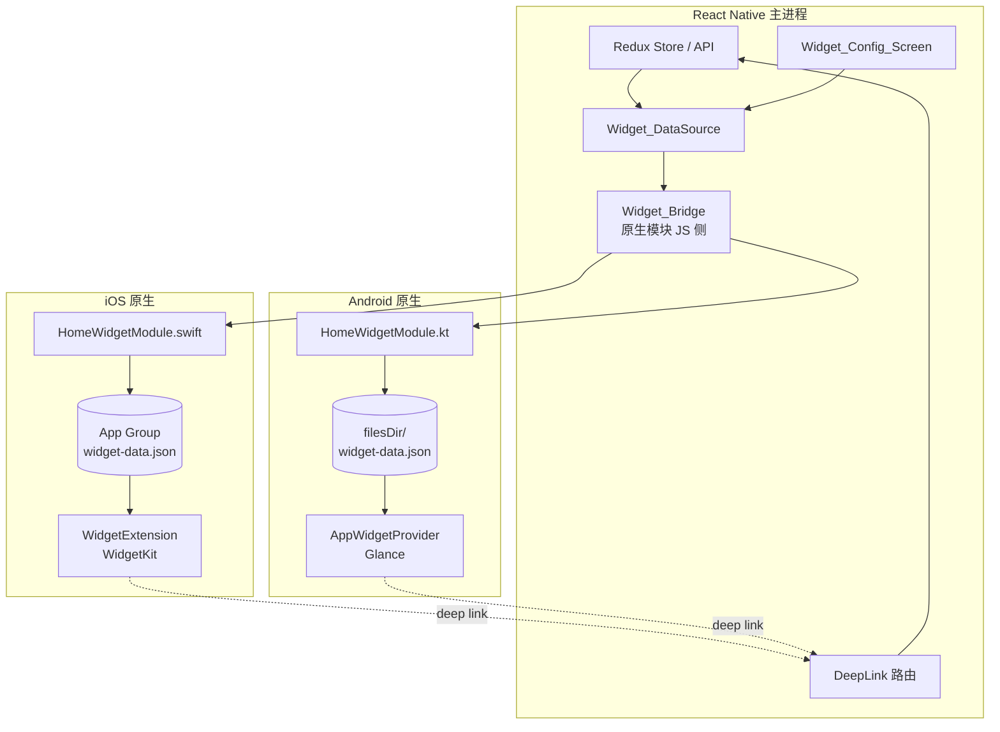

# 技术设计文档：ChewyBBTalk Mobile 主屏小组件

## 概述

本文档为 `mobile-home-widget` 需求定义技术实现方案。核心挑战是 Expo 项目需要同时集成 iOS WidgetKit 扩展与 Android AppWidget，而 Expo 默认不提供这类多 target 构建能力。

实施策略：

- 使用 `expo prebuild` 生成 `ios/` 与 `android/` 原生工程，手写一次性脚手架。
- 新建自定义 Expo Config Plugin（`plugins/withHomeWidget.js`），将 WidgetExtension target、App_Group entitlement、Android AppWidget 配置写入原生工程，使 `eas build` 可重复。
- 数据通过文件共享：iOS App_Group 的共享容器，Android 使用 `EXTERNAL_STORAGE` 下子目录或直接使用 app 内部 `filesDir`（Widget 与 App 共进程，无需跨进程容器）。

## 架构

### 高层视图



### 构建时改动

| 位置 | 改动 |
|------|------|
| `mobile/plugins/withHomeWidget.js` | 新建 Config Plugin。iOS 侧通过 `@bacons/xcode` 或手动 xcodeproj 操作追加 WidgetExtension target；Android 侧写入 AndroidManifest 与资源文件。 |
| `mobile/app.json` | 在 `plugins` 数组追加 `./plugins/withHomeWidget` 引用；新增 `ios.entitlements` 指向 App_Group；Android 在 `android.package` 保持不变。 |
| `mobile/ios/HomeWidget/` | 新建 Widget Extension 源码（Swift）。与主 app 共用 Bundle ID 前缀，例如 `com.chewy.bbtalk.HomeWidget`。 |
| `mobile/android/app/src/main/java/com/chewy/bbtalk/widget/` | 新建 Kotlin AppWidget 实现（采用 Glance，依赖 `androidx.glance:glance-appwidget`）。 |
| `mobile/modules/home-widget/` | Expo Modules 原生模块，桥接 JS `writeWidgetData`、`reloadWidget`、`isWidgetSupported`。 |

由于 Expo Go 不支持自定义原生模块，开发阶段需使用 `eas build --profile development` 生成 dev client；Web / Expo Go 侧通过 `isWidgetSupported=false` 跳过。

## 组件与接口

### 数据契约：`widget-data.json`

```json
{
  "version": 1,
  "generatedAt": "2026-05-08T10:00:00Z",
  "configHash": "a3f9e1",
  "locked": false,
  "authenticated": true,
  "theme": {
    "primary": "#3B82F6",
    "background": "#FFFFFF",
    "text": "#1F2937"
  },
  "items": [
    {
      "uid": "Ab3xYz9QKd",
      "content": "今天天气不错，去公园走了一圈",
      "updatedAt": "2026-05-08T09:55:00Z",
      "isPinned": true,
      "visibility": "public",
      "tags": [{ "name": "日常", "color": "#60A5FA" }],
      "thumbnailUrl": "https://cdn.example.com/thumb/a.jpg"
    }
  ],
  "placeholder": null
}
```

- 所有字段都由原生侧反序列化为强类型结构体（Swift `Codable` / Kotlin `@Serializable`）。
- 当 `items` 为空，`placeholder` 字段提供占位文案（后端翻译可扩展）。
- `version=1` 用于后续结构演进的兼容处理。

### JS 侧：`Widget_DataSource`

新建 `mobile/src/services/widget/`：

```
widget/
├── index.ts               # 公开 API：syncWidget()、clearWidget()
├── datasource.ts          # 根据 config 从 Redux 中筛选条目
├── config.ts              # 读写 AsyncStorage 中的 widget config
└── types.ts               # WidgetConfig、WidgetPayload、WidgetItem 类型
```

核心 API：

```ts
export interface WidgetConfig {
  strategy: 'pinned' | 'recent' | 'tags' | 'manual';
  recentCount: 3 | 5 | 10;
  tagIds: string[];
  manualUids: string[];
  includePrivate: boolean;
}

export async function syncWidget(): Promise<void>;
export async function clearWidget(reason: 'logout' | 'locked' | 'empty'): Promise<void>;
export async function loadWidgetConfig(): Promise<WidgetConfig>;
export async function saveWidgetConfig(config: WidgetConfig): Promise<void>;
```

`syncWidget()` 在以下时机调用（通过订阅 Redux store 或在具体 action 后手动触发）：

- App 启动认证完成后。
- `bbtalkSlice.fetchBBTalks.fulfilled`、`fetchMore.fulfilled`。
- 发布 / 编辑 / 删除 / 置顶成功后。
- Widget_Config_Screen 保存配置后。
- Privacy_Guard lock / unlock 时。
- 登出时改为调用 `clearWidget('logout')`。

### 原生模块：`Widget_Bridge`

使用 Expo Modules API（`expo-modules-core`）。新建 `mobile/modules/home-widget/`：

```
home-widget/
├── expo-module.config.json
├── ios/
│   └── HomeWidgetModule.swift
├── android/
│   └── src/main/java/.../HomeWidgetModule.kt
└── src/
    └── index.ts            # JS 侧封装
```

公开的 JS 方法：

```ts
export function isSupported(): boolean;
export async function writeWidgetData(json: string): Promise<void>;
export async function reloadWidget(): Promise<void>;
export async function readWidgetData(): Promise<string | null>; // debug 用
```

iOS 实现关键点：

- 使用 `UserDefaults(suiteName: "group.com.chewy.bbtalk")` 或直接写 `FileManager.default.containerURL(forSecurityApplicationGroupIdentifier:)` 下的 `widget-data.json`。
- 调用 `WidgetCenter.shared.reloadAllTimelines()` 触发刷新。
- 主 target 与 Widget target 都必须声明 `com.apple.security.application-groups = group.com.chewy.bbtalk` entitlement。

Android 实现关键点：

- 写入 `context.filesDir/widget-data.json`。Android AppWidget 与 App 同进程同包，可直接读取。
- 调用 `AppWidgetManager.getInstance(ctx).notifyAppWidgetViewDataChanged(...)` 或通过 `GlanceAppWidget.updateAll(context)` 触发刷新（Glance API）。

### iOS Widget Extension 结构

```
ios/HomeWidget/
├── HomeWidget.swift            # @main 入口，WidgetBundle 声明
├── HomeWidgetTimelineProvider.swift
├── HomeWidgetEntryView.swift    # small / medium / large 三种视图
├── WidgetDataLoader.swift       # 读取 App Group 内 JSON
├── Assets.xcassets
└── Info.plist
```

Timeline 策略：

- 每次 reload 时生成一个 `Entry(date: now, payload: loaded)`。
- 同时追加一个 `date: now + 30m` 的 fallback entry 让系统自动刷新。
- `Policy: .after(next30mDate)` 保证 30 分钟左右系统会再次请求 timeline。

WidgetKit 的 `Link` API 用于实现"点击卡片打开对应 deep link"：

```swift
Link(destination: URL(string: "chewybbtalk://edit/\(item.uid)")!) {
    BBTalkCardView(item: item)
}
```

顶部新建按钮：

```swift
Link(destination: URL(string: "chewybbtalk://compose?source=widget")!) {
    HStack { Image(systemName: "plus.circle.fill"); Text("记录") }
}
```

### Android Widget 实现（Glance）

使用 `androidx.glance:glance-appwidget:1.1.0+`（依赖 Kotlin + Compose runtime）。关键类：

- `HomeBBTalkWidget.kt`: `GlanceAppWidget` 子类，`provideGlance` 中读取 JSON 并调用 Composable 渲染。
- `HomeBBTalkWidgetReceiver.kt`: `GlanceAppWidgetReceiver` 子类，系统调度入口。
- `res/xml/home_bbtalk_widget_info.xml`: 声明最小宽高、预览图、resizeMode。
- `AndroidManifest.xml` 注册 receiver 并声明 intent-filter `APPWIDGET_UPDATE`。

点击处理：

```kotlin
modifier = GlanceModifier.clickable(
    actionStartActivity(
        Intent(Intent.ACTION_VIEW, Uri.parse("chewybbtalk://compose?source=widget"))
    )
)
```

主 App 需要在 `AndroidManifest.xml` 的主 Activity 声明 `android:launchMode="singleTask"` 与自定义 scheme intent-filter，保证从小组件拉起时不会开新实例。

### App 内配置页面：`Widget_Config_Screen`

新建 `mobile/src/screens/WidgetConfigScreen.tsx`，导航路由 `WidgetConfig`，入口位于 SettingsScreen 的 `个性化 → 主屏小组件`。

布局（自上而下）：

1. 三种尺寸预览卡片横向滚动（small / medium / large），基于当前 `WidgetConfig` 实时构造假数据并使用与原生 widget 对齐的 RN 组件渲染，保证 WYSIWYG。
2. "数据来源"单选组：置顶 / 最近 / 按标签 / 手动。
3. 不同 strategy 下渲染不同子控件：
   - `recent`：SegmentedControl 选 N=3/5/10。
   - `tags`：多选标签列表（复用现有 TagPickerModal）。
   - `manual`：按钮"选择碎碎念" → 打开 BBTalkPicker，已选列表可拖动排序。
4. 可见性开关："允许展示私密条目"（默认关）+ 风险提示。
5. 底部"保存"按钮，保存成功后 Toast 并自动 `syncWidget()`。

### Deep Link 路由

扩展 `mobile/src/navigation/`（或现有 linking 配置）：

```ts
const linking = {
  prefixes: ['chewybbtalk://', 'https://bbtalk.cone387.top/app'],
  config: {
    screens: {
      Compose: 'compose',
      BBTalkDetail: 'edit/:uid',
      Home: '',
    },
  },
};
```

`ComposeScreen` 在 `route.params.source === 'widget'` 时，`useEffect` 触发 `inputRef.current?.focus()`。

`BBTalkDetailScreen`（或 `ComposeScreen` 编辑模式）接收 `uid` 后，先尝试从 Redux 找对应条目；找不到则 `navigation.replace('Home')` 并 `Toast.show('该记录已不存在')`。

未登录拦截：`AuthGate` 组件已存在，linking 命中后先经过 AuthGate，未登录会自动跳 Login 并保存 pending route，登录成功后再 `navigation.replace(pendingRoute)`。

## 数据模型

### 前端：`WidgetConfig`

持久化在 AsyncStorage，键 `bbtalk.widget.config`，取默认值：

```ts
const DEFAULT_CONFIG: WidgetConfig = {
  strategy: 'recent',
  recentCount: 5,
  tagIds: [],
  manualUids: [],
  includePrivate: false,
};
```

`configHash` = SHA1(JSON.stringify(normalizedConfig)).slice(0, 6)。

### 原生：JSON 载荷

字段与上文 `widget-data.json` 示例一致。iOS `Codable` 结构：

```swift
struct WidgetPayload: Codable {
    let version: Int
    let generatedAt: String
    let configHash: String
    let locked: Bool
    let authenticated: Bool
    let theme: WidgetTheme
    let items: [WidgetItem]
    let placeholder: String?
}
```

### 数据筛选逻辑（datasource.ts）

```ts
export function selectWidgetItems(
  config: WidgetConfig,
  bbtalks: BBTalk[],
  tagIndex: Map<string, Tag>,
): WidgetItem[] {
  let source = bbtalks.filter(b => config.includePrivate ? true : b.visibility === 'public');

  switch (config.strategy) {
    case 'pinned':
      source = source.filter(b => b.isPinned);
      break;
    case 'recent':
      source = [...source].sort((a, b) => b.updatedAt.localeCompare(a.updatedAt));
      break;
    case 'tags':
      source = source.filter(b => b.tags.some(t => config.tagIds.includes(t.uid)));
      break;
    case 'manual':
      const order = new Map(config.manualUids.map((u, i) => [u, i]));
      source = source
        .filter(b => order.has(b.uid))
        .sort((a, b) => (order.get(a.uid)! - order.get(b.uid)!));
      break;
  }

  const maxItems = config.strategy === 'manual' ? config.manualUids.length : (config.recentCount ?? 6);
  return source.slice(0, Math.min(maxItems, 10)).map(toWidgetItem);
}
```

## 正确性属性

### Property 1：配置筛选稳定性

*For any* BBTalk 列表与任意 `WidgetConfig`，`selectWidgetItems(config, list)` 返回结果的长度不超过 `min(strategy 上限, list.length)`，且结果中所有条目均来自输入 list（集合包含关系）。

**Validates: 需求 2.2, 2.3, 4.1-4.3**

### Property 2：可见性过滤

*For any* `WidgetConfig.includePrivate === false` 与任意 BBTalk 列表，`selectWidgetItems` 返回的所有条目的 `visibility === 'public'`。

**Validates: 需求 6.3**

### Property 3：payload 裁剪

*For any* `BBTalk` 条目 `b`，`toWidgetItem(b).content.length <= 200` 且 `tags.length <= 3`。

**Validates: 需求 3.2, 7.3**

### Property 4：manual 顺序保持

*For any* `WidgetConfig.strategy === 'manual'` 且 `manualUids = [u1, u2, ..., un]`，当所有 uid 都命中 BBTalk 列表时，结果顺序与 `manualUids` 完全一致。

**Validates: 需求 2.2（manual 策略）**

## 错误处理

| 场景 | 处理 |
|------|------|
| `isSupported() === false`（Expo Go / Web） | `syncWidget` 直接 resolve，打印 info 日志 |
| 原生写文件失败 | 捕获 Promise reject，`console.warn`；不影响主 UI 流程 |
| JSON 过大（>32KB） | 数据裁剪循环：先降 items 数 → 再截 content → 最后不带 thumbnail |
| `reloadWidget` 连续失败 3 次 | 停止触发 reload 一段时间（5 分钟冷却），但继续写文件，让系统定时刷新兜底 |
| Deep Link uid 不存在 | `BBTalkDetail` 组件捕获后 `navigation.replace('Home')` + Toast |
| 未登录收到 deep link | `AuthGate` 保存 pending route，登录后自动跳转 |
| 防窥锁定期间 | `syncWidget` 替换 payload 为 `{ locked: true, items: [] }` |

## 测试策略

### 属性测试（fast-check）

| Property | 测试文件 | 说明 |
|----------|----------|------|
| P1 | `__tests__/widget/datasource.property.test.ts` | 随机生成 BBTalk 列表与 config，断言长度与子集关系 |
| P2 | 同上 | 构造 includePrivate=false，断言结果全为 public |
| P3 | `__tests__/widget/payload.property.test.ts` | 随机 BBTalk，断言 `toWidgetItem` 结果字段长度 |
| P4 | 同 P1 | 固定 manual 顺序，断言输出顺序一致 |

### 单元测试

- `config.test.ts`：读写 AsyncStorage、默认值、configHash 稳定性。
- `DeepLink.test.ts`：mock linking，断言 compose/edit 路径解析正确。
- `WidgetConfigScreen.test.tsx`：渲染、切换策略、保存触发 syncWidget。
- `HomeWidgetModule.test.ts`（JS 侧 mock）：`isSupported` 在 web/Expo Go 返回 false。

### 原生端手动验证

| 场景 | 平台 | 验证点 |
|------|------|--------|
| 首次添加小组件 | iOS | 三种尺寸在主屏都能添加并正确渲染 |
| 主 App 发布一条 → 小组件 30s 内更新 | 双平台 | WidgetKit timeline 生效 |
| 点击新建按钮 | 双平台 | 拉起 App，直接进入 Compose，输入框自动聚焦 |
| 点击条目卡片 | 双平台 | 打开对应编辑页 |
| 防窥模式锁定后查看小组件 | 双平台 | 显示"已锁定 🔒" |
| 登出后查看小组件 | 双平台 | 显示"请登录"占位 |
| 深色模式切换 | 双平台 | 小组件颜色同步 |
| 配置切换到 manual + 5 条 | 双平台 | 展示顺序与用户挑选一致 |

### 性能测试

- `yarn bundle-analyzer` 确认主 App 包体积增量 < 2 MB。
- Xcode Instruments + Widget Tester：冷启动渲染时长 < 200 ms。
- Android Profile GPU：首次 onUpdate 完成时间 < 300 ms。

## 后续演进（非本期实现）

- **用户可配置主题色**：当前 widget 使用与 App 默认蓝主题一致的固定色，未来接入 Theme_System 后 payload 中的 `theme` 字段会随用户选择变化。
- **Live Activities / 灵动岛**：iOS 16+，在录入长语音或发布进行中时弹出 Live Activity。
- **Widget Configuration Intent**（iOS）：让用户在长按 widget 编辑时直接选择策略，而不必进入 App 配置页。
- **Android 12+ Material You 动态取色**：使用系统壁纸配色。
