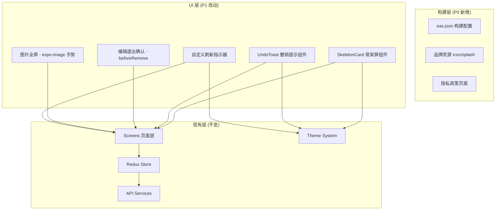

# 技术设计文档：ChewyBBTalk Mobile 下一阶段

## 概述

本设计文档覆盖 ChewyBBTalk Mobile 下一阶段（P0 上架准备 + P1 体验优化）共 10 项需求的技术实现方案。

需求分为两类：
- **P0 上架准备**（需求 1-5）：EAS Build 配置、品牌资源、隐私政策、App Store 资料、公网后端部署。这些主要是配置和资料准备工作，涉及少量代码改动。
- **P1 体验优化**（需求 6-10）：骨架屏、编辑退出确认、删除撤销、图片全屏优化、下拉刷新动画。这些是纯前端功能开发。

技术栈保持不变：Expo SDK 54 + React Native + TypeScript + Redux Toolkit + React Navigation。

## 架构

### 整体架构不变

现有架构已经成熟，下一阶段的改动集中在 UI 层和构建配置层，不涉及架构调整。



### 改动范围

| 需求 | 改动文件 | 类型 |
|------|----------|------|
| 1. EAS Build | `eas.json`(新建), `app.json` | 配置 |
| 2. 品牌资源 | `app.json`, `assets/` | 配置+资源 |
| 3. 隐私政策 | `SettingsScreen.tsx`, `LoginScreen.tsx`, 新建隐私政策页面/URL | UI+配置 |
| 4. App Store 资料 | 无代码改动，纯资料准备 | 文档 |
| 5. 公网后端 | `src/config.ts` | 配置 |
| 6. 骨架屏 | `HomeScreen.tsx`, 新建 `SkeletonCard.tsx` | UI 组件 |
| 7. 编辑退出确认 | `ComposeScreen.tsx` | UI 逻辑 |
| 8. 删除撤销 | `HomeScreen.tsx`, `bbtalkSlice.ts`, 新建 `UndoToast.tsx` | UI+状态 |
| 9. 图片全屏 | `HomeScreen.tsx` | UI |
| 10. 下拉刷新 | `HomeScreen.tsx` | UI |

## 组件与接口

### 需求 1：EAS Build 构建配置

新建 `mobile/eas.json`，定义三个构建 profile：

```json
{
  "cli": { "version": ">= 15.0.0" },
  "build": {
    "development": {
      "developmentClient": true,
      "distribution": "internal"
    },
    "preview": {
      "distribution": "internal"
    },
    "production": {
      "autoIncrement": true
    }
  },
  "submit": {
    "production": {
      "ios": { "appleId": "developer@example.com", "ascAppId": "APP_ID", "appleTeamId": "TEAM_ID" }
    }
  }
}
```

修改 `app.json`，添加 `ios.bundleIdentifier`：

```json
{
  "expo": {
    "ios": {
      "bundleIdentifier": "com.chewy.bbtalk",
      "buildNumber": "1"
    }
  }
}
```

**设计决策**：使用 EAS 托管签名（Managed Credentials），由 EAS 自动管理证书和 Provisioning Profile，降低手动配置复杂度。

### 需求 2：App 品牌资源

- 替换 `assets/icon.png` 为 1024x1024 应用图标
- 替换 `assets/splash-icon.png` 为启动屏图片
- 更新 `app.json` 中 `name` 为正式应用名（如 "ChewyBBTalk"）和 `version`

无需代码改动，纯资源替换。Expo 的 splash screen 机制会自动在应用初始化完成前显示启动屏。

### 需求 3：隐私政策

**方案**：创建一个静态隐私政策 HTML 页面，部署到公网后端同域名下（如 `/privacy-policy/`）。

代码改动：
- `SettingsScreen.tsx`：在菜单列表中添加"隐私政策"项，点击用 `Linking.openURL()` 打开
- `LoginScreen.tsx`：在注册表单底部添加隐私政策链接文案

```typescript
// SettingsScreen 新增菜单项
{ key: 'privacy-policy', title: '隐私政策', subtitle: '查看数据收集与使用说明', icon: 'shield-checkmark', bgColor: '#0EA5E9' }

// 点击处理
if (key === 'privacy-policy') {
  Linking.openURL(`${getApiBaseUrl()}/privacy-policy/`);
}
```

### 需求 4：App Store 上架资料

纯资料准备工作，不涉及代码改动。需要准备：
- 两套截图（6.7" + 5.5"）
- 元数据（标题、副标题、关键词、描述）
- 分类选择
- 测试账号信息

### 需求 5：公网后端部署

修改 `src/config.ts`，将默认 API 地址改为生产环境 HTTPS 地址：

```typescript
const PRODUCTION_API_URL = 'https://api.chewy.example.com';

const DEFAULT_API_URL = Platform.select({
  android: __DEV__ ? `http://10.0.2.2:8020` : PRODUCTION_API_URL,
  ios: __DEV__ ? `http://${LAN_IP}:8020` : PRODUCTION_API_URL,
  web: __DEV__ ? 'http://localhost:8020' : PRODUCTION_API_URL,
  default: PRODUCTION_API_URL,
})!;
```

网络错误处理：现有 `apiClient.ts` 的 `request` 方法在 `fetch` 失败时会抛出异常，但未区分网络不可达和服务端错误。需要增强错误处理：

```typescript
// apiClient.ts request 方法增强
try {
  response = await fetch(url, options);
} catch (error) {
  throw new Error('网络连接失败，请检查网络设置');
}
```

### 需求 6：骨架屏与加载态

**新建组件** `src/components/SkeletonCard.tsx`：

```typescript
interface SkeletonCardProps {
  theme: Theme;
}
```

骨架屏组件使用 `Animated` API 实现脉冲闪烁动画，布局模拟 BBTalk 卡片结构：
- 顶部：圆形头像占位 + 两行文字占位
- 中部：3-4 行不等长文字占位
- 底部：时间 + 图标占位

**集成到 HomeScreen**：

```typescript
// HomeScreen 中
const isFirstLoad = bbtalks.length === 0 && isLoading;

// FlatList 的 ListEmptyComponent
ListEmptyComponent={isFirstLoad ? (
  <View>
    {[0, 1, 2, 3].map(i => <SkeletonCard key={i} theme={theme} />)}
  </View>
) : /* 现有空状态 */}
```

**主题适配**：骨架屏的灰色占位块颜色从 `theme.colors.borderLight` 和 `theme.colors.border` 取值，确保在深色主题下也协调。

**过渡动画**：使用 `LayoutAnimation` 在数据加载完成时实现平滑过渡。

### 需求 7：编辑退出确认

修改 `ComposeScreen.tsx`，利用 React Navigation 的 `beforeRemove` 事件：

```typescript
// 判断是否有未保存修改
const hasUnsavedChanges = useCallback(() => {
  if (isEditing && editItem) {
    const originalContent = editItem.tags.map(t => `#${t.name} `).join('') + editItem.content;
    return content !== originalContent || 
           visibility !== editItem.visibility ||
           JSON.stringify(attachments.map(a => a.uid)) !== JSON.stringify(editItem.attachments.map(a => a.uid));
  }
  return content.trim().length > 0 || attachments.length > 0;
}, [content, visibility, attachments, editItem, isEditing]);

// beforeRemove 拦截
useEffect(() => {
  const unsubscribe = navigation.addListener('beforeRemove', (e) => {
    if (publishedRef.current || !hasUnsavedChanges()) return;
    e.preventDefault();
    Alert.alert('放弃编辑？', '你有未保存的内容，确定要放弃吗？', [
      { text: '继续编辑', style: 'cancel' },
      { text: '放弃', style: 'destructive', onPress: () => navigation.dispatch(e.data.action) },
    ]);
  });
  return unsubscribe;
}, [navigation, hasUnsavedChanges]);
```

**设计决策**：替换现有的草稿自动保存逻辑中的 `beforeRemove` 监听器。发布成功后 `publishedRef.current = true` 跳过确认。编辑模式下比较当前内容与原始内容，相同则直接返回。

### 需求 8：删除撤销

这是最复杂的 P1 需求，采用"乐观删除 + 延迟提交"模式：

**新建组件** `src/components/UndoToast.tsx`：

```typescript
interface UndoToastProps {
  visible: boolean;
  message: string;
  onUndo: () => void;
  onDismiss: () => void;
  duration?: number; // 默认 3000ms
}
```

使用 `Animated` 实现从底部滑入/滑出动画。

**状态管理改动** `bbtalkSlice.ts`：

新增 reducer：
```typescript
// 乐观删除：从列表移除但不发 API
optimisticDelete: (state, action: PayloadAction<string>) => {
  state.bbtalks = state.bbtalks.filter(b => b.id !== action.payload);
  state.totalCount -= 1;
},
// 撤销删除：恢复到列表
undoDelete: (state, action: PayloadAction<{ bbtalk: BBTalk; index: number }>) => {
  state.bbtalks.splice(action.payload.index, 0, action.payload.bbtalk);
  state.totalCount += 1;
},
```

**HomeScreen 集成**：

```typescript
const [pendingDelete, setPendingDelete] = useState<{ bbtalk: BBTalk; index: number } | null>(null);
const deleteTimerRef = useRef<ReturnType<typeof setTimeout> | null>(null);

const handleDelete = (item: BBTalk) => {
  // 记录位置和数据
  const index = bbtalks.findIndex(b => b.id === item.id);
  setPendingDelete({ bbtalk: item, index });
  
  // 乐观删除
  dispatch(optimisticDelete(item.id));
  
  // 3 秒后真正删除
  deleteTimerRef.current = setTimeout(async () => {
    try {
      await bbtalkApi.deleteBBTalk(item.id);
    } catch (error) {
      // 删除失败，恢复
      dispatch(undoDelete({ bbtalk: item, index }));
      showError('删除失败', error.message);
    }
    setPendingDelete(null);
  }, 3000);
};

const handleUndo = () => {
  if (deleteTimerRef.current) clearTimeout(deleteTimerRef.current);
  if (pendingDelete) {
    dispatch(undoDelete(pendingDelete));
    setPendingDelete(null);
  }
};
```

**设计决策**：
- 使用乐观更新而非等待 API 响应，用户体验更流畅
- 3 秒延迟期间不发送 API 请求，撤销时无需回滚服务端状态
- 删除失败时自动恢复列表项并提示错误

### 需求 9：图片全屏优化

替换现有的 `ScrollView` + `Image` 方案为 `expo-image` 的手势缩放：

```typescript
// 替换现有 Modal 内容
<Modal visible={!!previewImage} transparent animationType="fade" onRequestClose={() => setPreviewImage(null)}>
  <View style={styles.previewOverlay}>
    <TouchableOpacity style={styles.previewClose} onPress={() => setPreviewImage(null)}>
      <Ionicons name="close" size={28} color="#fff" />
    </TouchableOpacity>
    {previewImage && (
      <ImageViewer
        imageUrl={previewImage}
        onClose={() => setPreviewImage(null)}
      />
    )}
  </View>
</Modal>
```

**新建组件** `src/components/ImageViewer.tsx`：

使用 React Native 的 `PanResponder` + `Animated` 实现：
- 双指捏合缩放（pinch-to-zoom）
- 双击缩放/还原
- 缩放状态下单指拖动平移
- 未缩放状态下向下滑动关闭

```typescript
interface ImageViewerProps {
  imageUrl: string;
  onClose: () => void;
}
```

**设计决策**：不引入额外的手势库（如 react-native-gesture-handler），使用 RN 内置的 `PanResponder` + `Animated` 实现，保持依赖最小化。expo-image 的 `contentFit="contain"` 确保图片初始完整显示。

### 需求 10：下拉刷新动画

自定义 `RefreshControl` 的颜色以匹配主题：

```typescript
<RefreshControl
  refreshing={refreshing}
  onRefresh={onRefresh}
  tintColor={c.primary}        // iOS 刷新指示器颜色
  colors={[c.primary]}          // Android 刷新指示器颜色
  progressBackgroundColor={c.surface}  // Android 背景色
/>
```

**设计决策**：React Native 的 `RefreshControl` 原生支持自定义颜色，无需自定义组件。iOS 使用 `tintColor`，Android 使用 `colors` 数组。这是最简方案，效果好且零额外依赖。

## 数据模型

### 现有数据模型不变

需求 1-10 不涉及新的数据实体或 API 接口变更。

### 状态变更

`bbtalkSlice.ts` 新增两个同步 reducer 用于删除撤销：

```typescript
interface BBTalkState {
  // 现有字段不变
  bbtalks: BBTalk[];
  currentPage: number;
  hasMore: boolean;
  isLoading: boolean;
  error: string | null;
  totalCount: number;
}

// 新增 reducers
optimisticDelete(state, action: PayloadAction<string>)
undoDelete(state, action: PayloadAction<{ bbtalk: BBTalk; index: number }>)
```

### 配置数据

| 配置项 | 存储位置 | 说明 |
|--------|----------|------|
| 生产 API 地址 | `config.ts` 硬编码 | `__DEV__` 区分开发/生产 |
| Bundle Identifier | `app.json` | `com.chewy.bbtalk` |
| EAS 构建配置 | `eas.json` | 三个 profile |


## 正确性属性

*属性（Property）是指在系统所有有效执行中都应成立的特征或行为——本质上是对系统应做什么的形式化陈述。属性是人类可读规格说明与机器可验证正确性保证之间的桥梁。*

本阶段的 10 项需求中，需求 1-5 为配置/资料准备工作，需求 9-10 为纯 UI 交互，均不适合属性测试。需求 6（骨架屏）为 UI 渲染，适合快照测试。

需求 7（编辑退出确认）和需求 8（删除撤销）包含可属性测试的纯逻辑：

### Property 1: 未保存修改检测的正确性

*For any* 编辑场景（新建或编辑模式），给定原始内容和当前内容，`hasUnsavedChanges` 函数应当返回 `true` 当且仅当当前内容与原始内容不同（内容文本、可见性或附件列表任一不同）。

**Validates: Requirements 7.1, 7.4**

### Property 2: 乐观删除的列表不变量

*For any* BBTalk 列表和列表中的任意一条 BBTalk，执行 `optimisticDelete` 后，该 BBTalk 不应出现在列表中，且列表长度应恰好减少 1，其余项的相对顺序保持不变。

**Validates: Requirements 8.1**

### Property 3: 删除-撤销往返恢复

*For any* BBTalk 列表和列表中的任意一条 BBTalk，先执行 `optimisticDelete` 再执行 `undoDelete`（传入原始 BBTalk 和原始索引），列表应恢复到与操作前完全相同的状态（相同的项、相同的顺序、相同的 totalCount）。

**Validates: Requirements 8.3**

## 错误处理

### 网络错误（需求 5）

| 场景 | 处理方式 |
|------|----------|
| 后端不可达（DNS 失败、连接超时） | `apiClient` 捕获 `fetch` 异常，抛出 "网络连接失败，请检查网络设置" |
| HTTPS 证书错误 | 系统级拒绝，App 显示网络错误提示 |
| 401 + 刷新失败 | 现有逻辑：清除认证信息，要求重新登录 |

### 删除撤销错误（需求 8）

| 场景 | 处理方式 |
|------|----------|
| 3 秒内用户撤销 | 清除定时器，恢复列表项，不发送 API 请求 |
| 3 秒后 API 删除失败 | 恢复列表项到原位置，显示错误弹窗（支持复制错误信息） |
| 撤销期间 App 被杀 | BBTalk 未被真正删除（API 未调用），下次打开自动恢复 |

### 编辑退出确认错误（需求 7）

| 场景 | 处理方式 |
|------|----------|
| 用户选择"放弃" | 丢弃内容，清除草稿，返回上一页 |
| 用户选择"继续编辑" | 关闭对话框，保持编辑状态 |
| 发布成功后返回 | 跳过确认对话框（`publishedRef.current = true`） |

## 测试策略

### 测试方法

本阶段采用双轨测试策略：

1. **属性测试（Property-Based Testing）**：验证需求 7 和需求 8 中的纯逻辑
2. **单元测试（Example-Based）**：验证具体场景、边界条件和 UI 行为
3. **手动测试**：验证手势交互、动画效果和 App Store 配置

### 属性测试配置

- 测试库：[fast-check](https://github.com/dubzzz/fast-check)（TypeScript 属性测试库）
- 每个属性测试最少运行 100 次迭代
- 每个测试用注释标注对应的设计属性
- 标注格式：**Feature: mobile-next-phase, Property {number}: {property_text}**

### 属性测试计划

| Property | 测试内容 | 生成器 |
|----------|----------|--------|
| Property 1 | `hasUnsavedChanges` 函数 | 随机生成 BBTalk 内容（字符串、可见性、附件列表），随机决定是否修改 |
| Property 2 | `optimisticDelete` reducer | 随机生成 BBTalk 列表（1-50 项），随机选择一项删除 |
| Property 3 | `optimisticDelete` + `undoDelete` 组合 | 同 Property 2 的生成器 |

### 单元测试计划

| 需求 | 测试内容 | 类型 |
|------|----------|------|
| 需求 1 | `eas.json` 包含三个 profile | Smoke |
| 需求 1 | `app.json` 包含 `ios.bundleIdentifier` | Smoke |
| 需求 3 | SettingsScreen 渲染隐私政策菜单项 | Example |
| 需求 5 | `config.ts` 生产环境 URL 为 HTTPS | Smoke |
| 需求 5 | `apiClient` 网络错误返回友好提示 | Example |
| 需求 6 | SkeletonCard 在各主题下使用主题色 | Example |
| 需求 7 | 发布成功后返回不弹确认框 | Example |
| 需求 8 | UndoToast 3 秒后自动消失 | Example |
| 需求 8 | API 删除失败时恢复列表项 | Example |
| 需求 10 | RefreshControl 颜色匹配主题 primary | Example |

### 手动测试计划

| 需求 | 测试内容 |
|------|----------|
| 需求 2 | 启动屏显示正确的品牌图片 |
| 需求 4 | App Store 截图和元数据完整 |
| 需求 6 | 骨架屏动画流畅，过渡自然 |
| 需求 9 | 双指缩放、双击缩放、拖动平移、下滑关闭手势 |
| 需求 10 | 下拉刷新动画在各主题下颜色正确 |
