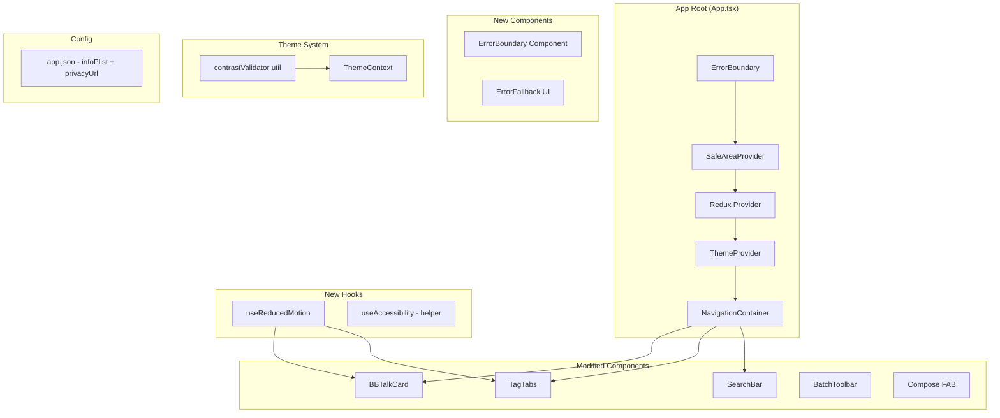

# Design Document: Mobile UI App Store Ready

## Overview

This design covers the technical implementation of App Store readiness improvements for ChewyBBTalk mobile. The scope includes accessibility compliance (VoiceOver labels, touch targets), animation consistency with reduced-motion support, error boundary resilience, iOS permission declarations, privacy policy configuration, and WCAG AA color contrast verification across all 5 themes.

The implementation follows a non-breaking, additive approach — enhancing existing components with accessibility props, wrapping the navigation tree in an error boundary, and adjusting theme colors where contrast ratios fall short.

## Architecture



**Wrapping order** (outermost → innermost):
1. `ErrorBoundary` — catches render errors before they crash the app
2. `SafeAreaProvider`
3. `Redux Provider`
4. `ThemeProvider`
5. `NavigationContainer`

## Components and Interfaces

### 1. ErrorBoundary Component

**File:** `mobile/src/components/ErrorBoundary.tsx`

```typescript
interface ErrorBoundaryProps {
  children: React.ReactNode;
  fallback?: React.ReactNode;
}

interface ErrorBoundaryState {
  hasError: boolean;
  error: Error | null;
  componentStack: string | null;
  timestamp: number | null;
}

// Serializable error state for round-trip property
interface SerializedErrorState {
  message: string;
  componentStack: string | null;
  timestamp: number;
}
```

- Class component (React error boundaries require `componentDidCatch`)
- Catches errors via `getDerivedStateFromError` + `componentDidCatch`
- Renders `ErrorFallback` when `hasError === true`
- Logs via existing `logError` utility
- Provides `serializeErrorState` and `deserializeErrorState` static methods

### 2. ErrorFallback Component

**File:** `mobile/src/components/ErrorFallback.tsx`

```typescript
interface ErrorFallbackProps {
  onRetry: () => void;
  errorMessage?: string;
}
```

- Displays "出了点问题" heading
- Shows a retry button (44x44pt minimum touch target)
- Uses theme colors from `useTheme()`
- Accessible: `accessibilityRole="alert"` on container

### 3. useReducedMotion Hook

**File:** `mobile/src/hooks/useReducedMotion.ts`

```typescript
function useReducedMotion(): boolean
```

- Reads `AccessibilityInfo.isReduceMotionEnabled()` on mount
- Subscribes to `reduceMotionChanged` event for live updates
- Returns `true` when user prefers reduced motion
- Used by animated components to set duration to 0

### 4. Contrast Validator Utility

**File:** `mobile/src/utils/contrastValidator.ts`

```typescript
interface ContrastResult {
  ratio: number;
  passesAA: boolean;       // >= 4.5:1
  passesAALarge: boolean;  // >= 3:1
}

function hexToLuminance(hex: string): number;
function getContrastRatio(fg: string, bg: string): ContrastResult;
function validateThemeContrast(colors: ThemeColors): ContrastViolation[];
```

- Pure functions for WCAG contrast calculation
- Used at dev-time and in property-based tests to verify all 5 themes
- No runtime overhead in production (test-only utility)

### 5. Error State Serializer

**File:** `mobile/src/utils/errorSerializer.ts`

```typescript
function serializeErrorState(state: SerializedErrorState): string;
function deserializeErrorState(json: string): SerializedErrorState;
```

- JSON serialization/deserialization of error boundary state
- Round-trip property: `deserialize(serialize(x)) === x` for all valid states

## Data Models

### SerializedErrorState

```typescript
interface SerializedErrorState {
  message: string;           // Error message text
  componentStack: string | null;  // React component stack trace
  timestamp: number;         // Unix timestamp (ms) when error was caught
}
```

### ThemeColors (existing, to be validated)

All 5 theme color sets already defined in `ThemeContext.tsx`. The design validates these against WCAG AA requirements:

| Pair | Requirement | Themes Affected |
|------|-------------|-----------------|
| `text` / `background` | ≥ 4.5:1 | All |
| `textSecondary` / `background` | ≥ 4.5:1 | All |
| `textSecondary` / `surface` | ≥ 4.5:1 | All |
| `textTertiary` / `surface` | ≥ 3:1 | All |
| `primary` / `background` | ≥ 3:1 | All |

### app.json Additions

```json
{
  "expo": {
    "ios": {
      "infoPlist": {
        "NSPhotoLibraryUsageDescription": "用于将照片附加到碎碎念条目中",
        "NSLocationWhenInUseUsageDescription": "用于为碎碎念条目添加位置标记",
        "NSCameraUsageDescription": "用于拍照并附加到碎碎念条目中"
      },
      "privacyUrl": "https://bbtalk.cone387.top/privacy/"
    }
  }
}
```

## Correctness Properties

*A property is a characteristic or behavior that should hold true across all valid executions of a system — essentially, a formal statement about what the system should do. Properties serve as the bridge between human-readable specifications and machine-verifiable correctness guarantees.*

### Property 1: Tappable card accessibility label includes content

*For any* BBTalkCard rendered with arbitrary text content, the component SHALL output an `accessibilityRole` of "button" and an `accessibilityLabel` that contains a substring of the card's text content.

**Validates: Requirements 1.4**

### Property 2: Animation duration respects reduced motion preference

*For any* animation configuration and any boolean `reducedMotion` value, the resolved duration SHALL be 0ms when `reducedMotion` is true, and between 200ms and 300ms (inclusive) when `reducedMotion` is false.

**Validates: Requirements 3.1, 3.2**

### Property 3: Error boundary catches render errors

*For any* Error object thrown during a child component's render phase, the ErrorBoundary SHALL transition to error state (`hasError === true`) and render the fallback UI instead of propagating the crash.

**Validates: Requirements 4.2**

### Property 4: Theme color contrast meets WCAG AA

*For any* theme in the THEMES array, the following contrast ratios SHALL hold:
- `text` vs `background` ≥ 4.5:1
- `textSecondary` vs `background` ≥ 4.5:1
- `textSecondary` vs `surface` ≥ 4.5:1
- `textTertiary` vs `surface` ≥ 3:1
- `primary` vs `background` ≥ 3:1

**Validates: Requirements 7.1, 7.2, 7.3, 7.5**

### Property 5: Error state serialization round-trip

*For any* valid `SerializedErrorState` object (with arbitrary message string, optional componentStack string, and numeric timestamp), `deserializeErrorState(serializeErrorState(state))` SHALL produce an object deeply equal to the original state.

**Validates: Requirements 8.1, 8.2, 8.3**

## Error Handling

### Error Boundary Strategy

| Error Type | Handling |
|-----------|----------|
| Render error in child component | ErrorBoundary catches, shows fallback, logs via `logError` |
| Async error (network, API) | Existing `classifyError` + `showError` pattern (unchanged) |
| Theme loading failure | Falls back to default theme (light) — existing behavior |
| Permission denial | Handled per-feature with user-facing explanation |

### ErrorBoundary Behavior

1. `getDerivedStateFromError(error)` → sets `hasError: true`, captures error
2. `componentDidCatch(error, info)` → calls `logError(error, 'ErrorBoundary')`, serializes state
3. Fallback renders "出了点问题" + retry button
4. Retry resets state: `{ hasError: false, error: null, componentStack: null, timestamp: null }`

### Graceful Degradation

- If `useReducedMotion` fails to read system preference → defaults to `false` (animations enabled)
- If contrast validation finds violations at dev-time → colors are adjusted before release
- If privacy URL is unreachable → app still functions; URL is metadata-only for App Store

## Testing Strategy

### Property-Based Tests (fast-check)

The project already has `fast-check` in devDependencies. Each property test runs minimum 100 iterations.

| Property | Test File | Library |
|----------|-----------|---------|
| P1: Card accessibility | `__tests__/properties/cardAccessibility.test.tsx` | fast-check + @testing-library/react-native |
| P2: Animation duration | `__tests__/properties/animationDuration.test.ts` | fast-check |
| P3: Error boundary | `__tests__/properties/errorBoundary.test.tsx` | fast-check + @testing-library/react-native |
| P4: Theme contrast | `__tests__/properties/themeContrast.test.ts` | fast-check |
| P5: Error serialization | `__tests__/properties/errorSerializer.test.ts` | fast-check |

**Configuration:** Each test tagged with comment:
```typescript
// Feature: mobile-ui-appstore-ready, Property 1: Tappable card accessibility label includes content
```

### Unit Tests (Jest)

| Area | Tests |
|------|-------|
| ErrorBoundary | Renders children normally; shows fallback on error; retry resets state; calls logError |
| ErrorFallback | Renders Chinese message; retry button has 44pt target; accessible |
| useReducedMotion | Returns boolean; responds to system changes |
| contrastValidator | Correct ratio for known color pairs; edge cases (black/white = 21:1) |
| app.json | Contains all required infoPlist keys; privacyUrl is HTTPS |

### Integration Tests

| Area | Tests |
|------|-------|
| Privacy URL | Fetch `https://bbtalk.cone387.top/privacy/` returns 200 + HTML |
| Full app render | App renders without crash with ErrorBoundary wrapping |

### Accessibility Audit (Manual)

- VoiceOver walkthrough on iOS simulator for all screens
- Verify all icon buttons announce their action
- Verify touch targets with Accessibility Inspector

**Note:** Full WCAG compliance validation requires manual testing with assistive technologies and expert accessibility review.

