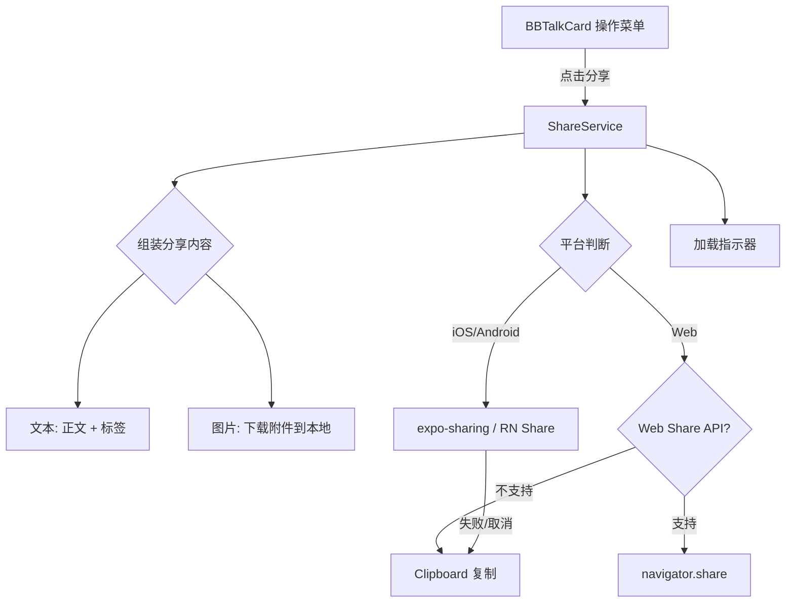
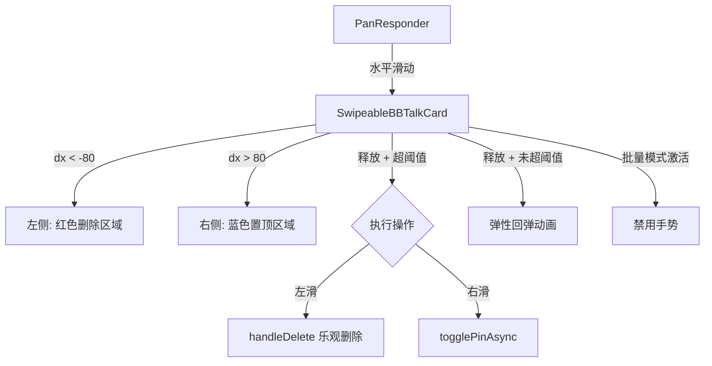
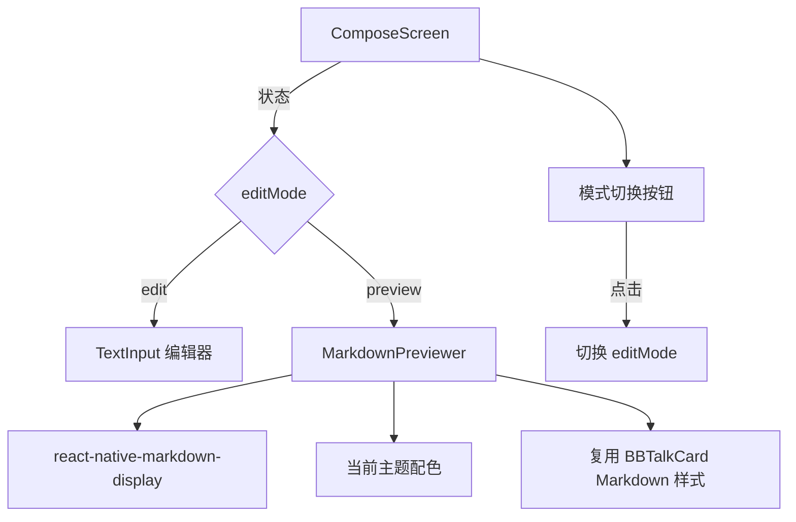
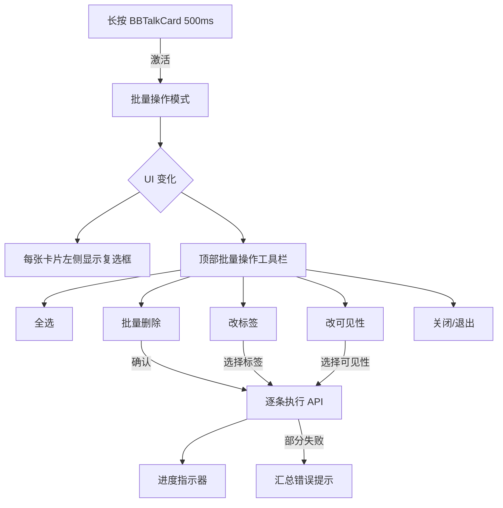
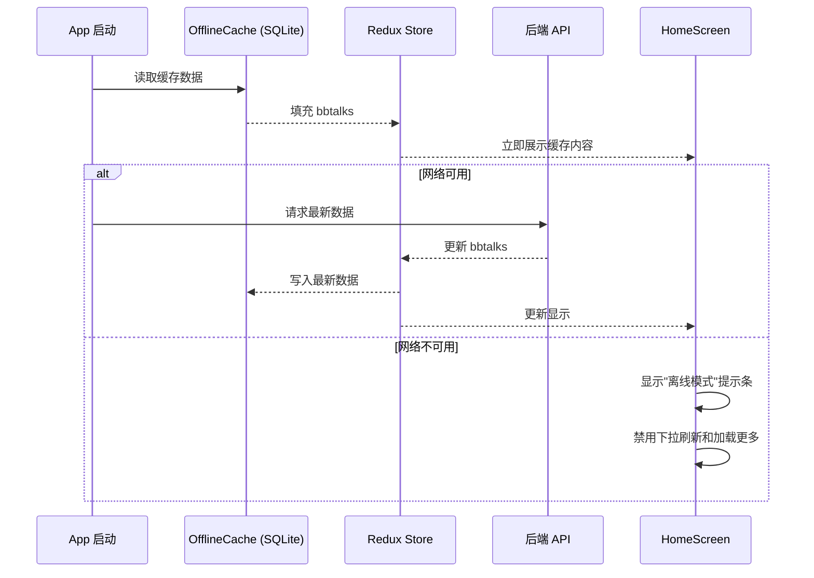

# 技术设计文档：ChewyBBTalk Mobile v1.1 增强

## 概述

本设计文档覆盖 ChewyBBTalk Mobile v1.1 版本的 5 项增强功能技术方案。核心目标分为两个方向：

**用户体验增强：**
1. **分享单条碎碎念** — 通过系统分享面板将 BBTalk 内容（文本+图片）分享到微信等应用，Web 端降级为剪贴板复制
2. **手势操作** — 在 BBTalkCard 上实现左滑删除、右滑置顶的手势交互，复用现有乐观删除机制
3. **Markdown 编辑实时预览** — 在 ComposeScreen 中增加编辑/预览模式切换，使用 react-native-markdown-display 渲染
4. **批量操作** — 长按进入多选模式，支持批量删除、改标签、改可见性

**技术基础建设：**
5. **离线缓存** — 使用 SQLite/MMKV 实现 BBTalk 数据本地持久化，支持 cache-first + 后台刷新策略

技术栈：
- Expo SDK 54 + React Native 0.81 + TypeScript + Redux Toolkit
- 现有依赖：react-native-markdown-display、expo-sharing、expo-clipboard、expo-image
- 后端：Django 5.2 + DRF，API 地址 https://bbtalk.cone387.top（本批次不涉及后端改动）

**设计决策总览：**
- 手势操作使用 React Native Animated API + PanResponder（项目已有此模式，见 useTagSwipe），不引入 react-native-gesture-handler 和 react-native-reanimated 新依赖
- 离线缓存选用 `expo-sqlite`（Expo SDK 54 内置支持），不引入 MMKV（需要 native module 配置）
- 批量操作状态管理在 HomeScreen 层通过 useState 管理，不扩展 Redux Store（批量选中是纯 UI 状态）
- 分享功能复用已有的 `useBBTalkActions` hook 中的 `shareBBTalk` 方法，增强图片分享能力

## 架构

### 整体架构不变

本批次增强属于前端层面的功能新增和交互优化，不改变现有的 Client → API → Backend 三层架构。所有改动集中在 Mobile 前端。

### 需求 1：分享功能架构



**设计决策：**
- 图片分享需要先将远程图片下载到本地临时目录（`expo-file-system`），再通过 `expo-sharing` 分享本地文件
- 多图分享：iOS 支持通过 `expo-sharing` 分享单个文件，多图场景组装为文本+首张图片；Android 类似
- 非图片附件（音频、视频、文件）不包含在分享内容中，仅分享文本
- 分享过程中显示 loading 状态，防止重复触发

### 需求 2：手势操作架构



**设计决策：**
- 创建 `SwipeableBBTalkCard` 包装组件，内部使用 `PanResponder` + `Animated.Value` 驱动滑动
- 使用 `useNativeDriver: true` 确保 60fps 动画性能
- 通过 ref 管理"同一时刻只有一张卡片展开"的约束：HomeScreen 持有 `openSwipeRef`，新卡片滑动时关闭旧卡片
- 左滑删除复用 `useBBTalkActions.handleDelete`（已有乐观删除+撤销机制）
- 右滑置顶复用 `togglePinAsync` Redux action

### 需求 3：Markdown 预览架构



**设计决策：**
- 在 ComposeScreen 中新增 `editMode: 'edit' | 'preview'` 状态
- 预览模式使用 `react-native-markdown-display`（项目已有此依赖），样式与 BBTalkCard 中的 Markdown 渲染保持一致
- 提取共享的 Markdown 样式生成函数 `getMarkdownStyles(colors)` 到 `mobile/src/utils/markdownStyles.ts`，BBTalkCard 和 MarkdownPreviewer 共用
- 切换回编辑模式时保持内容不变，光标位置通过 `cursorPos` state 恢复
- 模式切换按钮放在 header 区域（取消按钮和发布按钮之间）

### 需求 4：批量操作架构



**设计决策：**
- 批量选中状态使用 `useState<Set<string>>` 管理（选中的 BBTalk id 集合），不扩展 Redux
- 批量操作模式通过 `batchMode: boolean` 状态控制
- 创建 `useBatchMode` hook 封装批量操作逻辑（选中/取消选中/全选/执行批量操作）
- 批量删除使用确认对话框，确认后逐条调用 `bbtalkApi.deleteBBTalk`
- 批量改标签/改可见性使用 Modal 面板选择，确认后逐条调用 `bbtalkApi.updateBBTalk`
- 操作过程中显示进度（已完成/总数），禁用工具栏按钮
- 部分失败时汇总显示失败数量和原因

### 需求 5：离线缓存架构



**设计决策：**
- 使用 `expo-sqlite`（Expo SDK 54 内置，无需额外 native 配置）作为本地缓存数据库
- 缓存策略：cache-first + background refresh
  - App 启动时先从 SQLite 读取缓存数据快速展示
  - 同时在后台发起 API 请求，成功后替换缓存并更新 UI
- 缓存范围：BBTalk 核心字段（id、content、tags、visibility、isPinned、createdAt、updatedAt）+ 附件元信息（uid、type、url、filename）
- 不缓存图片二进制文件（依赖 `expo-image` 的 `cachePolicy="disk"` 自动缓存）
- 网络状态检测使用 `@react-native-community/netinfo`（需新增依赖）
- 创建 `useOfflineCache` hook 和 `OfflineCacheService` 类封装缓存逻辑
- 在 `loadBBTalks` thunk 中集成缓存读写逻辑

## 组件与接口

### 需求 1：分享功能 — 组件接口

#### ShareService 模块

文件路径：`mobile/src/services/shareService.ts`

```typescript
interface ShareContent {
  text: string;
  imageUris?: string[];  // 本地文件 URI
}

/** 组装 BBTalk 的分享内容文本 */
export function buildShareText(item: BBTalk): string;

/** 下载远程图片到本地临时目录，返回本地 URI 列表 */
export async function downloadImages(urls: string[]): Promise<string[]>;

/** 执行分享操作（系统分享面板 → 降级剪贴板） */
export async function shareBBTalk(item: BBTalk): Promise<void>;

/** 复制文本到剪贴板并显示提示 */
export async function copyToClipboard(text: string): Promise<void>;
```

**设计决策：**
- `buildShareText` 是纯函数：`content + '\n\n' + tags.map(t => '#' + t.name).join(' ')`
- `downloadImages` 使用 `expo-file-system` 的 `downloadAsync` 将远程图片下载到 `cacheDirectory`
- `shareBBTalk` 整合了平台判断、图片下载、分享调用、降级处理的完整流程
- 从 `useBBTalkActions` 中的内联 `shareBBTalk` 方法迁移到独立模块，增强图片分享能力

#### useBBTalkActions 改动

在 `mobile/src/hooks/useBBTalkActions.ts` 中：
- 将 `shareBBTalk` 方法替换为调用 `ShareService.shareBBTalk`
- 新增 `isSharing` 状态，分享过程中阻止重复触发

### 需求 2：手势操作 — 组件接口

#### SwipeableBBTalkCard

文件路径：`mobile/src/components/SwipeableBBTalkCard.tsx`

```typescript
interface SwipeableBBTalkCardProps {
  item: BBTalk;
  onDelete: (item: BBTalk) => void;
  onTogglePin: (item: BBTalk) => void;
  onMenu: (item: BBTalk) => void;
  onEdit: (item: BBTalk) => void;
  onToggleVisibility: (item: BBTalk) => void;
  onImagePreview: (url: string) => void;
  onLocationPress: (loc: { latitude: number; longitude: number }) => void;
  batchMode: boolean;
  selected: boolean;
  onSelect: (id: string) => void;
  openSwipeRef: React.MutableRefObject<(() => void) | null>;
  theme: Theme;
}
```

**设计决策：**
- `SwipeableBBTalkCard` 包装 `BBTalkCard`，在外层添加 PanResponder 手势层和左右操作区域
- `openSwipeRef` 用于实现"同一时刻只有一张卡片展开"：新卡片滑动时调用 `openSwipeRef.current?.()` 关闭旧卡片，然后将自己的关闭函数赋值给 ref
- `batchMode` 为 true 时禁用滑动手势，显示复选框
- 滑动阈值：80px 显示操作区域，释放时超过 120px 或速度 > 0.5 执行操作
- 使用 `Animated.spring` 实现弹性回弹动画

### 需求 3：Markdown 预览 — 组件接口

#### getMarkdownStyles 工具函数

文件路径：`mobile/src/utils/markdownStyles.ts`

```typescript
import type { ThemeColors } from '../theme/ThemeContext';

/** 生成 Markdown 渲染样式，BBTalkCard 和 ComposeScreen 预览共用 */
export function getMarkdownStyles(colors: ThemeColors): Record<string, any>;
```

**设计决策：**
- 从 BBTalkCard 中提取现有的 Markdown 样式对象为独立函数
- 接收 `ThemeColors` 参数，自动适配当前主题
- BBTalkCard 和 ComposeScreen 预览模式共用此函数，确保渲染一致性

#### ComposeScreen 改动

在 `mobile/src/screens/ComposeScreen.tsx` 中：
- 新增 `editMode: 'edit' | 'preview'` 状态，默认 `'edit'`
- Header 区域新增模式切换按钮（编辑图标 / 眼睛图标）
- 预览模式下用 `ScrollView` + `Markdown` 组件替换 `TextInput`
- 切换回编辑模式时恢复 `TextInput` 并保持 `content` 和 `cursorPos` 不变
- 预览模式下隐藏底部工具栏（Markdown 快捷按钮无意义）
- 空内容时预览区显示"暂无内容可预览"占位文字

### 需求 4：批量操作 — 组件接口

#### useBatchMode Hook

文件路径：`mobile/src/hooks/useBatchMode.ts`

```typescript
interface UseBatchModeReturn {
  batchMode: boolean;
  selectedIds: Set<string>;
  isExecuting: boolean;
  progress: { done: number; total: number } | null;

  enterBatchMode: (initialId: string) => void;
  exitBatchMode: () => void;
  toggleSelect: (id: string) => void;
  selectAll: (allIds: string[]) => void;
  batchDelete: (ids: string[]) => Promise<void>;
  batchUpdateTags: (ids: string[], tagNames: string[]) => Promise<void>;
  batchUpdateVisibility: (ids: string[], visibility: 'public' | 'private' | 'friends') => Promise<void>;
}

export function useBatchMode(options: {
  showError: (title: string, msg: string) => void;
  onComplete: () => void;  // 操作完成后刷新列表
}): UseBatchModeReturn;
```

#### BatchToolbar 组件

文件路径：`mobile/src/components/BatchToolbar.tsx`

```typescript
interface BatchToolbarProps {
  selectedCount: number;
  totalCount: number;
  isExecuting: boolean;
  progress: { done: number; total: number } | null;
  onSelectAll: () => void;
  onDelete: () => void;
  onChangeTags: () => void;
  onChangeVisibility: () => void;
  onClose: () => void;
  theme: Theme;
}
```

#### TagPickerModal 组件

文件路径：`mobile/src/components/TagPickerModal.tsx`

```typescript
interface TagPickerModalProps {
  visible: boolean;
  tags: Tag[];
  onConfirm: (selectedTagNames: string[]) => void;
  onClose: () => void;
  theme: Theme;
}
```

#### VisibilityPickerModal 组件

文件路径：`mobile/src/components/VisibilityPickerModal.tsx`

```typescript
interface VisibilityPickerModalProps {
  visible: boolean;
  onConfirm: (visibility: 'public' | 'private' | 'friends') => void;
  onClose: () => void;
  theme: Theme;
}
```

### 需求 5：离线缓存 — 组件接口

#### OfflineCacheService

文件路径：`mobile/src/services/offlineCacheService.ts`

```typescript
import type { BBTalk } from '../types';

/** 初始化 SQLite 数据库和表结构 */
export async function initCacheDB(): Promise<void>;

/** 将 BBTalk 列表写入缓存（全量替换） */
export async function cacheBBTalks(bbtalks: BBTalk[]): Promise<void>;

/** 从缓存读取 BBTalk 列表 */
export async function getCachedBBTalks(): Promise<BBTalk[]>;

/** 清除所有缓存数据 */
export async function clearCache(): Promise<void>;

/** 获取最后同步时间戳 */
export async function getLastSyncTime(): Promise<string | null>;

/** 更新最后同步时间戳 */
export async function setLastSyncTime(timestamp: string): Promise<void>;
```

**设计决策：**
- SQLite 表结构：`bbtalks` 表存储序列化的 BBTalk JSON（`id TEXT PRIMARY KEY, data TEXT, synced_at TEXT`）
- 使用 `expo-sqlite` 的同步 API（Expo SDK 54 支持）
- `cacheBBTalks` 使用事务批量写入，先清空再插入（全量替换策略，简单可靠）
- `getCachedBBTalks` 读取所有行并反序列化为 BBTalk 对象
- `meta` 表存储元信息（如 `last_sync_time`）

#### useOfflineCache Hook

文件路径：`mobile/src/hooks/useOfflineCache.ts`

```typescript
interface UseOfflineCacheReturn {
  isOffline: boolean;
  lastSyncTime: string | null;
  initCache: () => Promise<void>;
  loadCachedData: () => Promise<BBTalk[]>;
  syncToCache: (bbtalks: BBTalk[]) => Promise<void>;
}

export function useOfflineCache(): UseOfflineCacheReturn;
```

#### OfflineBanner 组件

文件路径：`mobile/src/components/OfflineBanner.tsx`

```typescript
interface OfflineBannerProps {
  isOffline: boolean;
  lastSyncTime: string | null;
  theme: Theme;
}
```

**设计决策：**
- 显示在 HomeScreen 列表顶部，FlatList 的 `ListHeaderComponent`
- 内容："离线模式 · 最后同步于 XX 分钟前"
- 使用主题的 `accent` 色作为背景

#### 新增依赖

```json
{
  "expo-sqlite": "~16.0.0",
  "@react-native-community/netinfo": "~12.0.0"
}
```

## 数据模型

### 现有数据模型（不变）

本批次增强不引入新的后端数据实体，复用现有的 `BBTalk`、`Tag`、`Attachment` 类型定义。

```typescript
// mobile/src/types/index.ts — 已有，不变
interface BBTalk {
  id: string;
  content: string;
  visibility: 'public' | 'private' | 'friends';
  tags: Tag[];
  attachments: Attachment[];
  context?: Record<string, any>;
  isPinned?: boolean;
  createdAt: string;
  updatedAt: string;
}
```

### 离线缓存 SQLite 表结构

```sql
-- BBTalk 缓存表
CREATE TABLE IF NOT EXISTS bbtalks (
  id TEXT PRIMARY KEY,
  data TEXT NOT NULL,       -- JSON 序列化的 BBTalk 对象
  synced_at TEXT NOT NULL   -- 写入时间 ISO 字符串
);

-- 元信息表
CREATE TABLE IF NOT EXISTS meta (
  key TEXT PRIMARY KEY,
  value TEXT NOT NULL
);
```

**设计决策：**
- 使用 JSON 序列化存储完整 BBTalk 对象（包括 tags、attachments 元信息），避免复杂的关系表设计
- `synced_at` 字段用于判断缓存新鲜度
- `meta` 表存储 `last_sync_time` 等全局元信息

### 批量操作 UI 状态（不持久化）

```typescript
// HomeScreen 内部状态，不扩展 Redux
interface BatchModeState {
  batchMode: boolean;
  selectedIds: Set<string>;
  isExecuting: boolean;
  progress: { done: number; total: number } | null;
}
```

### 分享内容组装模型

```typescript
interface ShareContent {
  text: string;           // 正文 + 标签
  imageUris?: string[];   // 本地临时文件 URI（下载后）
}
```

`buildShareText` 纯函数的输出格式：
```
{content}

#标签1 #标签2
```


## 正确性属性

*正确性属性是一种在系统所有有效执行中都应成立的特征或行为——本质上是对系统应做什么的形式化陈述。属性是人类可读规格说明与机器可验证正确性保证之间的桥梁。*

### 属性 1：分享文本组装正确性

*对于任意* BBTalk 对象（包含任意 content 字符串和任意数量的 tags），`buildShareText` 函数的输出应满足：
- 输出包含原始 content 文本
- 当 tags 非空时，输出包含所有 tag 名称（以 `#tagName` 格式）
- 输出不包含任何非图片附件（audio/video/file）的信息

**验证需求：1.2, 1.5**

### 属性 2：编辑/预览模式切换 round-trip

*对于任意* 编辑内容字符串和任意有效光标位置（0 到 content.length），从编辑模式切换到预览模式再切换回编辑模式后，内容字符串和光标位置应与切换前完全一致。

**验证需求：3.4**

### 属性 3：Markdown 样式主题适配一致性

*对于任意* ThemeColors 对象，`getMarkdownStyles(colors)` 函数应返回一个样式对象，其中：
- `body.color` 等于输入的 `colors.text`
- `code_inline.backgroundColor` 等于输入的 `colors.borderLight`
- `blockquote.borderLeftColor` 等于输入的 `colors.border`
- `link.color` 等于输入的 `colors.primary`
- `fence.backgroundColor` 等于输入的 `colors.borderLight`

**验证需求：3.5, 3.6**

### 属性 4：全选操作正确性

*对于任意* BBTalk id 列表（长度 1 到 N），执行 `selectAll(allIds)` 后，`selectedIds` 集合应包含列表中的每一个 id，且 `selectedIds.size` 等于列表长度。

**验证需求：4.4**

### 属性 5：退出批量模式清空状态

*对于任意* 批量操作状态（任意数量的已选中 id），执行 `exitBatchMode()` 后，`batchMode` 应为 `false`，`selectedIds` 应为空集合。

**验证需求：4.8**

### 属性 6：批量操作失败汇总正确性

*对于任意* N 条批量操作请求（N ≥ 1），其中 M 条失败（0 ≤ M ≤ N），操作完成后汇总的失败数量应等于 M，成功数量应等于 N - M。

**验证需求：4.9**

### 属性 7：离线缓存 round-trip

*对于任意* BBTalk 列表（包含任意 content、tags、attachments 元信息、visibility、isPinned 等字段），执行 `cacheBBTalks(list)` 写入缓存后，`getCachedBBTalks()` 读取的结果应与原始列表在语义上等价（相同的 id、content、tags、attachments 元信息、visibility、isPinned、createdAt、updatedAt）。

**验证需求：5.1**

### 属性 8：清除缓存正确性

*对于任意* 非空的缓存状态（已写入若干 BBTalk），执行 `clearCache()` 后，`getCachedBBTalks()` 应返回空列表，`getLastSyncTime()` 应返回 `null`。

**验证需求：5.10**

## 错误处理

### 需求 1（分享功能）

| 场景 | 处理方式 |
|------|---------|
| 系统分享面板调用失败 | 降级为复制到剪贴板，显示"已复制"提示 |
| 用户取消分享 | 提供"复制到剪贴板"选项 |
| 图片下载失败 | 跳过图片，仅分享文本内容，`logError` 记录 |
| Web Share API 不可用 | 直接复制文本到剪贴板 |

```typescript
async function shareBBTalk(item: BBTalk): Promise<void> {
  const text = buildShareText(item);
  try {
    // 尝试下载图片并分享
    const images = item.attachments.filter(a => a.type === 'image');
    let imageUris: string[] = [];
    if (images.length > 0) {
      try {
        imageUris = await downloadImages(images.map(a => a.url));
      } catch (e) {
        logError(e, 'download images for share');
        // 图片下载失败，降级为纯文本分享
      }
    }
    // 调用系统分享...
  } catch (e) {
    // 最终降级：复制到剪贴板
    await copyToClipboard(text);
  }
}
```

### 需求 2（手势操作）

| 场景 | 处理方式 |
|------|---------|
| 手势识别冲突（与 FlatList 滚动） | PanResponder 的 `onMoveShouldSetPanResponder` 中判断水平位移 > 垂直位移 * 1.5 |
| 删除操作失败 | 复用现有乐观删除+撤销机制，自动恢复 |
| 置顶操作失败 | 通过 `togglePinAsync.rejected` 在 Redux 中处理，`showError` 提示 |

### 需求 3（Markdown 预览）

| 场景 | 处理方式 |
|------|---------|
| Markdown 渲染异常 | react-native-markdown-display 内部处理，不会崩溃 |
| 空内容 | 显示"暂无内容可预览"占位文字 |
| 超长内容 | ScrollView 自动滚动，无特殊处理 |

### 需求 4（批量操作）

| 场景 | 处理方式 |
|------|---------|
| 批量删除部分失败 | 汇总显示失败数量和原因，已成功的不回滚 |
| 批量改标签/可见性部分失败 | 同上，汇总显示 |
| 操作过程中网络断开 | 后续请求失败，汇总显示 |
| 操作过程中用户切换页面 | 操作继续执行，结果在返回后显示（或丢弃） |

```typescript
async function batchDelete(ids: string[]): Promise<void> {
  let failed = 0;
  let errors: string[] = [];
  for (let i = 0; i < ids.length; i++) {
    setProgress({ done: i + 1, total: ids.length });
    try {
      await bbtalkApi.deleteBBTalk(ids[i]);
      dispatch(optimisticDelete(ids[i]));
    } catch (e: any) {
      failed++;
      errors.push(e.message || '未知错误');
    }
  }
  if (failed > 0) {
    showError('部分操作失败', `${ids.length} 条中有 ${failed} 条失败：${errors[0]}`);
  }
}
```

### 需求 5（离线缓存）

| 场景 | 处理方式 |
|------|---------|
| SQLite 初始化失败 | `logError` 记录，App 正常运行（无缓存功能） |
| 缓存写入失败 | `logError` 记录，不影响正常数据展示 |
| 缓存读取失败 | 返回空列表，等待 API 数据 |
| 缓存数据格式损坏 | JSON.parse 失败时跳过该条目，`logError` 记录 |
| 网络状态检测失败 | 默认为在线模式 |

```typescript
async function getCachedBBTalks(): Promise<BBTalk[]> {
  try {
    const rows = db.getAllSync('SELECT data FROM bbtalks ORDER BY synced_at DESC');
    return rows.map(row => {
      try {
        return JSON.parse(row.data);
      } catch (e) {
        logError(e, 'parse cached bbtalk');
        return null;
      }
    }).filter(Boolean);
  } catch (e) {
    logError(e, 'read cache');
    return [];
  }
}
```

## 测试策略

### 双重测试方法

本批次增强采用 **单元测试 + 属性测试** 的双重策略：

- **属性测试（Property-Based Testing）**：验证核心纯函数和状态管理逻辑的通用正确性，使用 `fast-check` 库
- **单元测试（Example-Based）**：验证特定场景、边界条件、UI 交互行为和集成点

### 属性测试配置

- **库**：`fast-check`（TypeScript 生态最成熟的 PBT 库）
- **最小迭代次数**：100 次/属性
- **标签格式**：`Feature: mobile-v1.1-enhancements, Property {number}: {property_text}`

### 属性测试计划

| 属性 | 测试目标 | 生成器 |
|------|---------|--------|
| 属性 1：分享文本组装 | `buildShareText` 纯函数 | 随机 BBTalk（随机 content 字符串 + 0-10 个随机 tag + 随机类型附件） |
| 属性 2：编辑/预览 round-trip | ComposeScreen 模式切换状态 | 随机 content 字符串 + 随机 cursorPos（0 到 content.length） |
| 属性 3：Markdown 样式主题适配 | `getMarkdownStyles` 纯函数 | 随机 ThemeColors 对象（随机颜色字符串） |
| 属性 4：全选操作 | `useBatchMode.selectAll` | 随机 id 列表（1-100 个随机 UUID） |
| 属性 5：退出批量模式 | `useBatchMode.exitBatchMode` | 随机已选中 id 集合 |
| 属性 6：批量操作失败汇总 | 批量操作执行逻辑 | 随机 N 条操作 + 随机 M 条失败（mock API） |
| 属性 7：缓存 round-trip | `cacheBBTalks` + `getCachedBBTalks` | 随机 BBTalk 列表（0-50 条，含随机 tags/attachments） |
| 属性 8：清除缓存 | `clearCache` + `getCachedBBTalks` | 随机非空缓存状态 |

### 单元测试计划

| 需求 | 测试内容 | 类型 |
|------|---------|------|
| 需求 1 | 系统分享面板调用（mock expo-sharing） | Integration |
| 需求 1 | 分享失败降级为剪贴板复制 | Example |
| 需求 1 | Web 平台使用 Web Share API | Example |
| 需求 1 | 图片下载失败降级为纯文本分享 | Example |
| 需求 1 | 分享过程中 isSharing 状态管理 | Example |
| 需求 2 | 左滑超过阈值触发删除回调 | Example |
| 需求 2 | 右滑超过阈值触发置顶回调 | Example |
| 需求 2 | 未超过阈值时弹性回弹 | Example |
| 需求 2 | 同一时刻只有一张卡片展开 | Example |
| 需求 2 | 批量模式下禁用手势 | Example |
| 需求 3 | 编辑/预览模式切换按钮存在 | Smoke |
| 需求 3 | 预览模式渲染 Markdown 组件 | Example |
| 需求 3 | 空内容显示占位文字 | Edge Case |
| 需求 4 | 长按 500ms 激活批量模式 | Example |
| 需求 4 | 批量模式下显示复选框和工具栏 | Example |
| 需求 4 | 批量删除确认对话框 | Example |
| 需求 4 | 操作过程中进度指示器和按钮禁用 | Example |
| 需求 5 | 网络不可用时显示离线提示条 | Example |
| 需求 5 | 离线模式禁用刷新和加载更多 | Example |
| 需求 5 | 离线状态下写操作提示 | Example |
| 需求 5 | cache-first 策略（先缓存后 API） | Integration |
| 需求 5 | 最后同步时间戳显示 | Example |

### 测试文件组织

```
mobile/
  __tests__/
    services/
      shareService.test.ts          # 属性 1 + 单元测试
    utils/
      markdownStyles.test.ts        # 属性 3
    hooks/
      useBatchMode.test.ts          # 属性 4, 5, 6
    services/
      offlineCacheService.test.ts   # 属性 7, 8
    screens/
      ComposeScreen.test.tsx        # 属性 2 + 单元测试
    components/
      SwipeableBBTalkCard.test.tsx   # 手势操作单元测试
      BatchToolbar.test.tsx          # 批量工具栏单元测试
      OfflineBanner.test.tsx         # 离线提示条单元测试
```

### 新增开发依赖

```json
{
  "fast-check": "^3.0.0",
  "jest": "^29.0.0",
  "@testing-library/react-native": "^12.0.0",
  "jest-expo": "~54.0.0"
}
```
