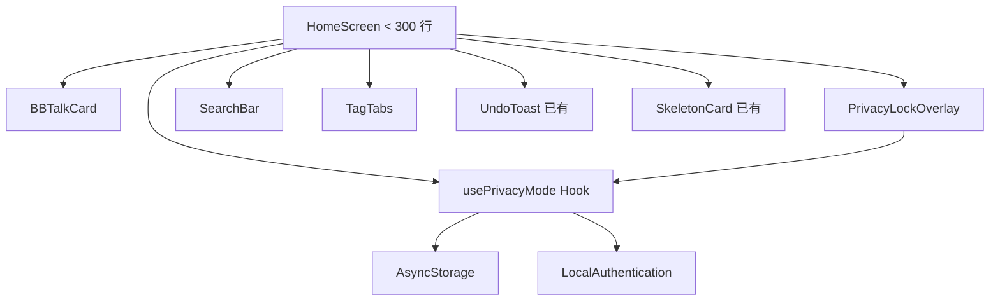
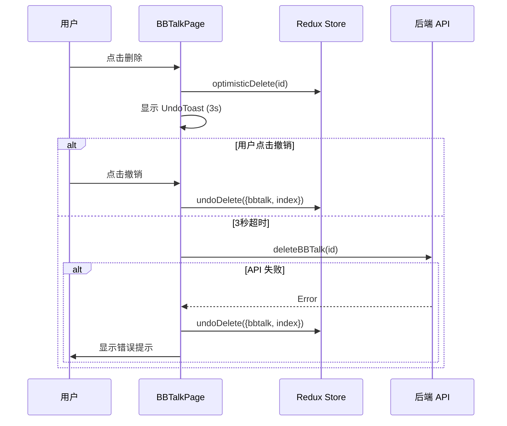
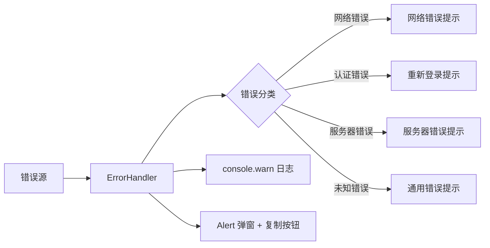
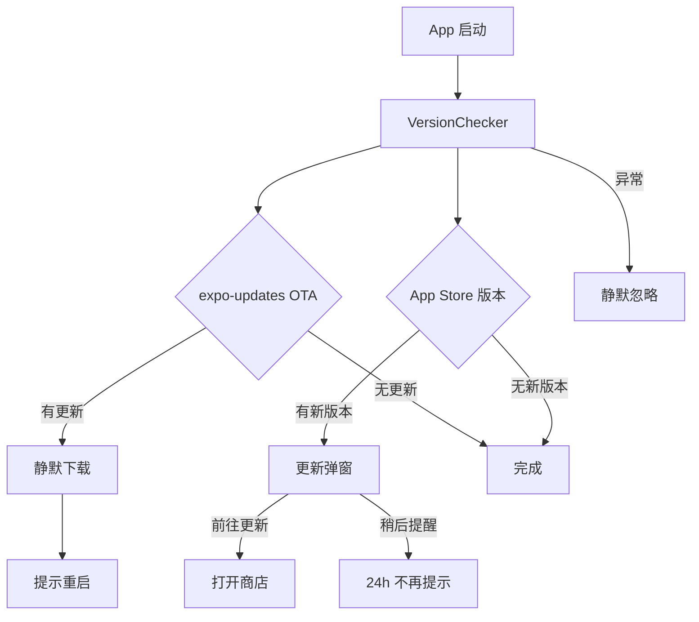

# 技术设计文档：ChewyBBTalk 系统优化（第一批）

## 概述

本设计文档覆盖 ChewyBBTalk 系统第一批 5 项优化的技术方案。核心目标是：

1. **代码可维护性**：将 952 行的 HomeScreen 拆分为职责单一的子组件和 Hook
2. **跨端体验一致性**：在 Web 端补齐 Mobile 端已有的删除撤销和骨架屏功能
3. **错误处理健壮性**：建立统一的错误处理机制，消除静默失败
4. **版本更新能力**：实现 OTA + App Store 双通道版本检测
5. **列表渲染性能**：通过 React.memo 和 useCallback 减少不必要的重渲染

技术栈：
- Mobile：Expo SDK 54 + React Native 0.81 + TypeScript + Redux Toolkit
- Web：React 18 + Vite + Tailwind CSS + Redux Toolkit
- 后端：Django 5.2 + DRF（本批次不涉及后端改动）

## 架构

### 整体架构不变

本批次优化属于前端层面的重构和功能补齐，不改变现有的 Client → API → Backend 三层架构。所有改动集中在 Mobile 和 Web 前端。

### 需求 1：HomeScreen 组件拆分架构



**拆分策略**：按 UI 区域 + 逻辑职责拆分。HomeScreen 退化为纯编排层，只负责组合子组件、传递 props 和协调状态。

### 需求 2：Web 删除撤销 + 骨架屏架构



**设计决策**：Web 端复用 Mobile 端已有的 Redux `optimisticDelete` / `undoDelete` actions，UI 组件（UndoToast、SkeletonCard）用 React + Tailwind CSS 重新实现。

### 需求 3：统一错误处理架构



### 需求 4：版本检测架构



**设计决策**：采用 OTA + App Store 双通道方案。OTA 通过 `expo-updates` 处理热更新（JS bundle），App Store 版本检查通过调用 iTunes/Google Play API 比较版本号。两个通道独立运行，互不阻塞。

### 需求 5：列表性能优化架构

无架构变更，属于渲染层优化。核心手段：
- `React.memo` + 自定义比较函数包裹 BBTalkCard
- `useCallback` 稳定所有传递给子组件的回调引用
- FlatList `renderItem` 用 `useCallback` 包裹

## 组件与接口

### 需求 1：HomeScreen 拆分 — 组件接口定义

#### BBTalkCard

文件路径：`mobile/src/components/BBTalkCard.tsx`

```typescript
interface BBTalkCardProps {
  item: BBTalk;
  onMenu: (item: BBTalk) => void;
  onEdit: (item: BBTalk) => void;
  onToggleVisibility: (item: BBTalk) => void;
  onImagePreview: (url: string) => void;
  onLocationPress: (loc: { latitude: number; longitude: number }) => void;
  theme: Theme;
}

// 使用 React.memo + 自定义比较函数（需求 5 联动）
const BBTalkCard = React.memo(function BBTalkCard(props: BBTalkCardProps) {
  // 渲染单条 BBTalk：内容 Markdown、标签、附件（图片/文件/音频/视频）、底部信息
}, arePropsEqual);
```

**设计决策**：
- `theme` 作为 prop 传入而非在组件内部调用 `useTheme()`，避免 theme context 变化时所有卡片重渲染
- 回调函数通过 props 传入，由 HomeScreen 用 `useCallback` 包裹后传递
- 附件渲染（AudioPlayerButton、VideoPlayerButton、ImageViewer）保持在 BBTalkCard 内部，因为它们是卡片的组成部分

#### PrivacyLockOverlay

文件路径：`mobile/src/components/PrivacyLockOverlay.tsx`

```typescript
interface PrivacyLockOverlayProps {
  locked: boolean;
  biometricAvailable: boolean;
  allowComposeWhenLocked: boolean;
  onUnlock: (password: string) => Promise<void>;
  onBiometricUnlock: () => Promise<void>;
  onCompose: () => void;
  theme: Theme;
}
```

**设计决策**：解锁逻辑（密码验证、生物识别）的实际执行仍在 HomeScreen 层（因为需要访问 auth 服务），PrivacyLockOverlay 只负责 UI 展示和用户输入收集。

#### SearchBar

文件路径：`mobile/src/components/SearchBar.tsx`

```typescript
interface SearchBarProps {
  visible: boolean;
  searchText: string;
  searchHistory: string[];
  onSearchTextChange: (text: string) => void;
  onSubmit: (text: string) => void;
  onClearHistory: () => void;
  onHistoryItemPress: (term: string) => void;
  onClose: () => void;
  theme: Theme;
}
```

#### TagTabs

文件路径：`mobile/src/components/TagTabs.tsx`

```typescript
interface TagTabsProps {
  tags: Tag[];
  selectedTag: string | null;
  selectedDate: string | null;
  onSelectTag: (tagId: string | null) => void;
  scrollRef: React.RefObject<ScrollView>;
  theme: Theme;
}
```

#### usePrivacyMode Hook

文件路径：`mobile/src/hooks/usePrivacyMode.ts`

```typescript
interface UsePrivacyModeReturn {
  // 状态
  locked: boolean;
  privacyEnabled: boolean;
  privacySeconds: number | null;
  showCountdown: boolean;
  biometricAvailable: boolean;
  allowComposeWhenLocked: boolean;
  
  // 操作
  setLocked: (val: boolean) => void;
  resetPrivacyTimer: () => void;
  handleBiometricUnlock: () => Promise<void>;
  handleUnlock: (password: string) => Promise<void>;
  loadPrivacySettings: () => Promise<void>;
}

function usePrivacyMode(options: {
  onLockChange?: (locked: boolean) => void;
  showError: (title: string, msg: string) => void;
}): UsePrivacyModeReturn;
```

**设计决策**：将 HomeScreen 中约 150 行的防窥相关状态和逻辑（倒计时轮询、锁定/解锁、设置加载、生物识别检测）全部提取到此 Hook。Hook 内部管理 AsyncStorage 读写和 LocalAuthentication 调用。

### 需求 2：Web 端新组件

#### Web UndoToast

文件路径：`frontend/src/components/UndoToast.tsx`

```typescript
interface UndoToastProps {
  visible: boolean;
  message?: string;       // 默认 "已删除"
  onUndo: () => void;
  onDismiss: () => void;
  duration?: number;       // 默认 3000ms
}
```

**实现方案**：
- 使用 CSS `transition` + `transform: translateY()` 实现底部滑入/滑出动画
- 固定定位在视口底部（`fixed bottom-4`）
- 3 秒倒计时使用 `setTimeout`，撤销时 `clearTimeout`
- 参考 Mobile 端 UndoToast 的交互逻辑，用 Tailwind CSS 重新实现样式

#### Web SkeletonCard

文件路径：`frontend/src/components/SkeletonCard.tsx`

```typescript
// 无 props，纯展示组件
function SkeletonCard(): JSX.Element;
```

**实现方案**：
- 使用 Tailwind CSS `animate-pulse` 实现脉冲动画（对标 Mobile 端的 Animated.loop）
- 布局模拟 BBTalk 卡片结构：文字行占位 → 标签行占位 → 附件区占位 → 底部行占位
- 首次加载时显示 3 张 SkeletonCard

#### BBTalkPage 改动

在 `frontend/src/pages/BBTalkPage.tsx` 中：
- 添加 `optimisticDelete` / `undoDelete` Redux actions（复用 Mobile 端已有的 slice 模式）
- 添加 `pendingDelete` 状态管理和 3 秒延迟删除逻辑
- 替换现有的 `deleteBBTalkAsync` 直接调用为乐观删除流程
- 在 `isLoading && bbtalks.length === 0` 时渲染 SkeletonCard 替代 "加载中..." 文字

### 需求 3：ErrorHandler 模块

文件路径：`mobile/src/utils/errorHandler.ts`

```typescript
/** 错误类型枚举 */
enum ErrorType {
  Network = 'NETWORK',
  Auth = 'AUTH',
  Server = 'SERVER',
  Validation = 'VALIDATION',
  Unknown = 'UNKNOWN',
}

/** 分类后的错误信息 */
interface ClassifiedError {
  type: ErrorType;
  title: string;
  message: string;
  originalError: unknown;
}

/** 错误分类函数 — 纯函数，根据错误对象判断类型并生成中文提示 */
function classifyError(error: unknown): ClassifiedError;

/** 显示错误弹窗（Alert + 复制按钮） */
function showError(error: unknown): void;

/** 显示错误弹窗（自定义标题和消息） */
function showErrorMessage(title: string, message: string): void;

/** 静默记录错误（console.warn），不弹窗 */
function logError(error: unknown, context?: string): void;
```

**错误分类策略**：

| 错误特征 | ErrorType | 中文提示 |
|---------|-----------|---------|
| `message` 包含 "网络" / "Network" / `TypeError: Network request failed` | Network | "网络连接失败，请检查网络设置" |
| HTTP 401 / `message` 包含 "认证" / "登录" / "过期" | Auth | "登录已过期，请重新登录" |
| HTTP 4xx/5xx / `message` 包含 "服务器" | Server | "服务器错误，请稍后重试" |
| 其他 | Unknown | "操作失败，请稍后重试" |

**替换策略**：
- 用户可感知的操作（删除、编辑、加载、分享等）的 `catch {}` → `catch (e) { showError(e) }`
- 非关键操作（AsyncStorage 缓存读写、日志记录、动画清理）保留静默处理，但添加 `logError(e, 'context')`

### 需求 4：VersionChecker 模块

文件路径：`mobile/src/utils/versionChecker.ts`

```typescript
interface VersionCheckResult {
  hasOTAUpdate: boolean;
  hasStoreUpdate: boolean;
  storeVersion?: string;
  storeUrl?: string;
}

/** 执行完整的版本检测流程 */
async function checkForUpdates(): Promise<void>;

/** 检查 OTA 更新（expo-updates） */
async function checkOTAUpdate(): Promise<boolean>;

/** 检查 App Store / Google Play 版本 */
async function checkStoreUpdate(): Promise<{
  hasUpdate: boolean;
  version?: string;
  url?: string;
}>;

/** 是否在 24 小时冷却期内 */
async function isInCooldown(): Promise<boolean>;

/** 设置 24 小时冷却期 */
async function setCooldown(): Promise<void>;
```

**版本检测方案**：

1. **OTA 更新**（expo-updates）：
   - 调用 `Updates.checkForUpdateAsync()` 检查是否有新的 JS bundle
   - 有更新时调用 `Updates.fetchUpdateAsync()` 静默下载
   - 下载完成后通过 Alert 提示用户重启：`Updates.reloadAsync()`
   - 仅在非 `__DEV__` 模式下执行（开发模式下 expo-updates 不可用）

2. **App Store 版本检查**：
   - iOS：请求 `https://itunes.apple.com/lookup?bundleId=com.chewy.bbtalk` 获取最新版本号
   - Android：请求 Google Play 页面或使用 `react-native-version-check` 库（考虑到项目依赖最小化，优先使用 iTunes API + 手动 fetch）
   - 比较 `Constants.expoConfig.version`（当前版本）与商店版本
   - 版本比较使用语义化版本比较（major.minor.patch）

3. **调用时机**：在 `App.tsx` 的 `ThemedNavigator` 组件中，认证成功后调用 `checkForUpdates()`

4. **冷却机制**：用户点击"稍后提醒"后，将当前时间戳存入 AsyncStorage，24 小时内不再弹窗

### 需求 5：React.memo 自定义比较函数

```typescript
function arePropsEqual(
  prevProps: BBTalkCardProps,
  nextProps: BBTalkCardProps
): boolean {
  // 1. 基础字段浅比较
  if (prevProps.item.id !== nextProps.item.id) return false;
  if (prevProps.item.content !== nextProps.item.content) return false;
  if (prevProps.item.updatedAt !== nextProps.item.updatedAt) return false;
  if (prevProps.item.isPinned !== nextProps.item.isPinned) return false;
  if (prevProps.item.visibility !== nextProps.item.visibility) return false;
  
  // 2. tags 数组浅比较（比较长度 + 每个 tag 的 id）
  const prevTags = prevProps.item.tags;
  const nextTags = nextProps.item.tags;
  if (prevTags.length !== nextTags.length) return false;
  for (let i = 0; i < prevTags.length; i++) {
    if (prevTags[i].id !== nextTags[i].id) return false;
  }
  
  // 3. attachments 数组浅比较（比较长度 + 每个 attachment 的 uid）
  const prevAtts = prevProps.item.attachments;
  const nextAtts = nextProps.item.attachments;
  if (prevAtts.length !== nextAtts.length) return false;
  for (let i = 0; i < prevAtts.length; i++) {
    if (prevAtts[i].uid !== nextAtts[i].uid) return false;
  }
  
  // 4. 回调函数引用比较（依赖 useCallback 保证稳定）
  if (prevProps.onMenu !== nextProps.onMenu) return false;
  if (prevProps.onEdit !== nextProps.onEdit) return false;
  if (prevProps.onToggleVisibility !== nextProps.onToggleVisibility) return false;
  if (prevProps.onImagePreview !== nextProps.onImagePreview) return false;
  if (prevProps.onLocationPress !== nextProps.onLocationPress) return false;
  
  // 5. theme 引用比较
  if (prevProps.theme !== nextProps.theme) return false;
  
  return true;
}
```

**设计决策**：
- 不使用 `JSON.stringify` 进行深比较（性能差）
- tags 和 attachments 只比较 id/uid，不比较内容字段（内容变化必然伴随 updatedAt 变化）
- 回调函数使用引用比较，要求 HomeScreen 侧用 `useCallback` 保证引用稳定

## 数据模型

### 现有数据模型（不变）

本批次优化不引入新的数据实体，复用现有的 `BBTalk`、`Tag`、`Attachment` 类型定义。

```typescript
// mobile/src/types/index.ts — 已有，不变
interface BBTalk {
  id: string;
  content: string;
  visibility: 'public' | 'private' | 'friends';
  tags: Tag[];
  attachments: Attachment[];
  context?: Record<string, any>;
  isPinned?: boolean;
  createdAt: string;
  updatedAt: string;
}
```

### Web Redux Store 扩展

为支持乐观删除，需要在 Web 端的 `bbtalkSlice` 中添加与 Mobile 端一致的 reducers：

```typescript
// frontend/src/store/slices/bbtalkSlice.ts — 新增 reducers
reducers: {
  // ... 现有 reducers
  optimisticDelete: (state, action: PayloadAction<string>) => {
    state.bbtalks = state.bbtalks.filter(b => b.id !== action.payload);
    state.totalCount -= 1;
  },
  undoDelete: (state, action: PayloadAction<{ bbtalk: BBTalk; index: number }>) => {
    state.bbtalks.splice(action.payload.index, 0, action.payload.bbtalk);
    state.totalCount += 1;
  },
}
```

### 版本检测本地存储

```typescript
// AsyncStorage keys
const VERSION_CHECK_COOLDOWN_KEY = 'version_check_cooldown_timestamp';
// 存储格式：ISO 时间戳字符串，如 "2026-04-17T10:00:00.000Z"
```

### ErrorHandler 错误分类模型

```typescript
enum ErrorType {
  Network = 'NETWORK',
  Auth = 'AUTH',
  Server = 'SERVER',
  Validation = 'VALIDATION',
  Unknown = 'UNKNOWN',
}

interface ClassifiedError {
  type: ErrorType;
  title: string;      // Alert 标题
  message: string;    // Alert 正文
  originalError: unknown;
}
```


## 正确性属性

*正确性属性是一种在系统所有有效执行中都应成立的特征或行为——本质上是对系统应做什么的形式化陈述。属性是人类可读规格说明与机器可验证正确性保证之间的桥梁。*

### 属性 1：乐观删除与撤销的 round-trip 属性

*对于任意* BBTalk 列表和列表中的任意一条 BBTalk，执行 `optimisticDelete` 后该条目应不在列表中且列表长度减 1；随后执行 `undoDelete` 应将列表恢复到与删除前完全一致的状态（相同的元素、相同的顺序）。

**验证需求：2.1, 2.2**

### 属性 2：错误分类函数的正确性

*对于任意* 错误对象（包含各种 message 字符串模式），`classifyError` 函数应返回一个 `ClassifiedError` 对象，其中：
- `type` 是有效的 `ErrorType` 枚举值
- `title` 是非空的中文字符串
- `message` 是非空的中文字符串
- 当错误消息包含网络相关关键词时，`type` 应为 `ErrorType.Network`
- 当错误消息包含认证相关关键词时，`type` 应为 `ErrorType.Auth`

**验证需求：3.1, 3.4**

### 属性 3：React.memo 自定义比较函数的正确性

*对于任意* 两组 `BBTalkCardProps`，`arePropsEqual` 函数应满足：
- 当两组 props 的所有关键字段（`id`、`content`、`updatedAt`、`isPinned`、`visibility`、`tags[].id`、`attachments[].uid`、回调引用、theme 引用）完全相同时，返回 `true`
- 当任一关键字段发生变化时，返回 `false`

**验证需求：5.3**

## 错误处理

### 需求 1（HomeScreen 拆分）

拆分过程中保持现有的错误处理行为不变。`showError` 回调从 HomeScreen 传递给子组件。

### 需求 2（Web 删除撤销）

| 场景 | 处理方式 |
|------|---------|
| 乐观删除后 API 调用失败 | 自动恢复被删除条目 + 显示错误提示 toast |
| UndoToast 渲染异常 | 不影响主列表功能，降级为无撤销的直接删除 |

### 需求 3（统一错误处理）

ErrorHandler 本身不应抛出异常。`classifyError` 和 `showError` 内部使用 try-catch 保护，确保错误处理代码不会成为新的错误源。

```typescript
function showError(error: unknown): void {
  try {
    const classified = classifyError(error);
    console.warn(`[ErrorHandler] ${classified.type}: ${classified.message}`, error);
    Alert.alert(classified.title, classified.message, [
      { text: '复制', onPress: () => Clipboard.setStringAsync(`${classified.title}: ${classified.message}`) },
      { text: '关闭' },
    ]);
  } catch (e) {
    // 最后的兜底：如果错误处理本身出错，至少输出日志
    console.warn('[ErrorHandler] 错误处理失败:', e);
  }
}
```

### 需求 4（版本检测）

整个版本检测流程包裹在 try-catch 中，任何异常都静默忽略（`console.warn` 记录），不影响 App 正常使用。

```typescript
async function checkForUpdates(): Promise<void> {
  try {
    // OTA 检查
    await checkOTAUpdate();
  } catch (e) {
    console.warn('[VersionChecker] OTA 检查失败:', e);
  }
  
  try {
    // App Store 版本检查
    await checkStoreUpdate();
  } catch (e) {
    console.warn('[VersionChecker] 商店版本检查失败:', e);
  }
}
```

### 需求 5（列表性能优化）

无额外错误处理需求。`arePropsEqual` 是纯比较函数，不涉及异步操作或外部调用。

## 测试策略

### 双重测试方法

本批次优化采用 **单元测试 + 属性测试** 的双重策略：

- **属性测试（Property-Based Testing）**：验证核心纯函数的通用正确性，使用 `fast-check` 库
- **单元测试（Example-Based）**：验证特定场景、边界条件和 UI 交互行为

### 属性测试配置

- **库**：`fast-check`（TypeScript 生态最成熟的 PBT 库）
- **最小迭代次数**：100 次/属性
- **标签格式**：`Feature: system-optimization-batch1, Property {number}: {property_text}`

### 属性测试计划

| 属性 | 测试目标 | 生成器 |
|------|---------|--------|
| 属性 1：乐观删除 round-trip | `optimisticDelete` + `undoDelete` reducers | 随机 BBTalk 列表（1-50 条）+ 随机选择一条删除 |
| 属性 2：错误分类正确性 | `classifyError` 纯函数 | 随机错误对象（含各种 message 模式：网络、认证、服务器、未知） |
| 属性 3：Props 比较函数正确性 | `arePropsEqual` 纯函数 | 随机 BBTalkCardProps 对（相同/变化某一字段） |

### 单元测试计划

| 需求 | 测试内容 | 类型 |
|------|---------|------|
| 需求 1 | 各子组件可正常渲染、HomeScreen 行数 < 300 | Smoke |
| 需求 2 | SkeletonCard 在加载态显示、数据加载后消失 | Example |
| 需求 2 | API 删除失败时条目恢复 | Example |
| 需求 3 | showError 调用 Alert.alert 且包含"复制"按钮 | Example |
| 需求 3 | logError 调用 console.warn | Example |
| 需求 4 | OTA 更新检测流程（mock expo-updates） | Integration |
| 需求 4 | App Store 版本比较逻辑 | Example |
| 需求 4 | 24 小时冷却期逻辑 | Example |
| 需求 4 | 异常时静默忽略 | Example |
| 需求 5 | BBTalkCard 在 props 不变时不重渲染 | Example |

### 测试文件组织

```
mobile/
  __tests__/
    utils/
      errorHandler.test.ts        # 属性 2 + 单元测试
    components/
      BBTalkCard.test.tsx          # 属性 3 + 渲染测试
    store/
      bbtalkSlice.test.ts          # 属性 1（可复用于 Web）
    utils/
      versionChecker.test.ts       # 单元测试
frontend/
  __tests__/
    components/
      UndoToast.test.tsx           # 单元测试
      SkeletonCard.test.tsx        # 单元测试
    store/
      bbtalkSlice.test.ts          # 属性 1（Web 端）
```
