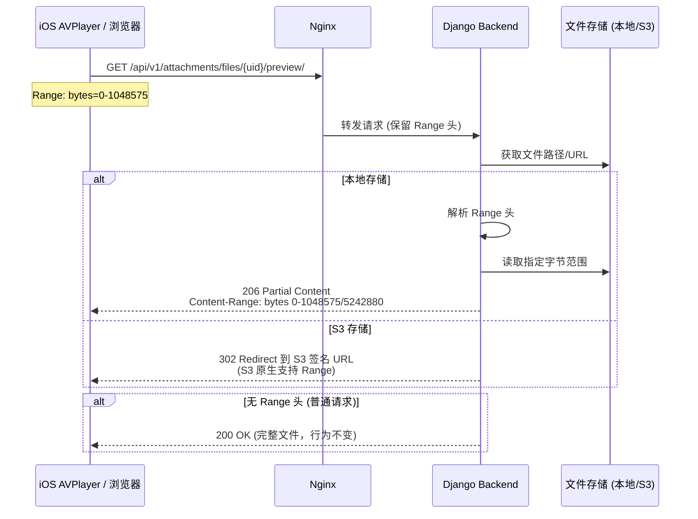

# 技术设计文档：系统级 P0 增强

## 概述

本设计文档覆盖 ChewyBBTalk 系统三个 P0 功能的技术实现方案：

1. **隐私政策页面**：在 Django 后端新增一个公开可访问的 HTML 页面端点 `/privacy-policy/`，用于满足 App Store 审核合规要求。
2. **HTTP Range 请求支持**：在附件预览端点（`/api/v1/attachments/files/{uid}/preview/`）上层重写 `preview` action，支持 HTTP Range 请求（RFC 7233），使 iOS AVPlayer 可以直接流式播放音频文件。设计核心原则是**向后兼容**——不改动 chewy-attachment 库源码，不影响 Mobile 端现有的下载-缓存-播放流程。
3. **Web 前端 Markdown 渲染**：引入 `react-markdown` 库，将 BBTalk 内容从纯文本 `whitespace-pre-wrap` 显示升级为 Markdown 富文本渲染，与 Mobile 端保持一致的阅读体验。

## 架构

### 整体架构不变

三个功能均为增量修改，不改变现有系统架构：

```
┌─────────────┐     ┌─────────┐     ┌──────────────────┐
│  Mobile App │────▶│  Nginx  │────▶│  Django Backend   │
│  Web 前端   │     │ :4010   │     │  (Gunicorn :8020) │
└─────────────┘     └─────────┘     └──────────────────┘
```

### 功能 1：隐私政策页面

```
浏览器/App Store 审核 ──▶ Nginx :4010 ──▶ /privacy-policy/ ──▶ Django View (AllowAny)
                                                                    │
                                                                    ▼
                                                            返回自包含 HTML 页面
```

- 在 Django 项目级 URL 配置（`chewy_space/urls.py`）中注册 `/privacy-policy/` 路由
- 使用简单的 Django View 函数返回 `HttpResponse`，内联 CSS，无需模板引擎
- Nginx 已有 `/api/` 代理规则，`/privacy-policy/` 不以 `/api/` 开头，需要在 Nginx 配置中添加代理规则将其转发到后端

### 功能 2：HTTP Range 请求支持



**关键设计决策：**

1. **仅重写本地存储的 preview action**：S3 存储通过 302 重定向到签名 URL，S3 原生支持 Range 请求，无需额外处理。
2. **在 `AttachmentViewSet` 子类中重写 `preview` 方法**：不修改 chewy-attachment 库源码，在项目的 `attachment_views.py` 中重写。
3. **向后兼容**：当请求不包含 `Range` 头时，保持原有 `FileResponse` 行为（200 + 完整文件）。Mobile 端现有的下载到本地缓存再播放的方式完全不受影响。
4. **Nginx 配置**：确保 Nginx 不会拦截或修改 `Range` 头，当前 `proxy_pass` 配置已经会透传请求头。

### 功能 3：Web 前端 Markdown 渲染

```
BBTalk.content (Markdown 字符串)
        │
        ▼
┌──────────────────────┐
│  MarkdownRenderer    │  ◀── 新建共享组件
│  (react-markdown)    │
│  + remark-gfm        │  ◀── GFM 支持 (表格、删除线等)
│  + rehype-sanitize   │  ◀── XSS 防护
│  + 自定义 components  │  ◀── Tailwind CSS 样式映射
└──────────────────────┘
        │
        ▼
  渲染为 HTML (安全的 React 元素)
```

**库选型理由：**

| 方案 | 优点 | 缺点 | 结论 |
|------|------|------|------|
| `react-markdown` | React 原生组件、支持自定义渲染、插件生态丰富、XSS 安全 | 包体积略大 | ✅ 选用 |
| `marked` + `dangerouslySetInnerHTML` | 轻量、快速 | 需要手动处理 XSS、非 React 原生 | ❌ |
| `markdown-to-jsx` | 轻量 | 插件生态较弱、自定义能力有限 | ❌ |

选择 `react-markdown` 的核心原因：
- 直接输出 React 元素，无需 `dangerouslySetInnerHTML`，天然防 XSS
- 通过 `components` prop 可以精确控制每个 HTML 元素的样式，与 Tailwind CSS 完美配合
- `rehype-sanitize` 插件提供额外的 HTML 标签过滤层
- 社区活跃，npm 周下载量 200 万+

## 组件与接口

### 功能 1：隐私政策页面

**新增文件：** `backend/chewy_space/bbtalk/privacy_views.py`

```python
# 接口定义
def privacy_policy_view(request) -> HttpResponse:
    """
    返回隐私政策 HTML 页面
    - 方法: GET
    - 权限: AllowAny (无需认证)
    - 返回: Content-Type: text/html, HTTP 200
    """
```

**URL 注册：** `backend/chewy_space/chewy_space/urls.py`

```python
urlpatterns = [
    path('privacy-policy/', privacy_policy_view, name='privacy_policy'),
    # ... 现有路由
]
```

**Nginx 配置变更：** `nginx.conf`

```nginx
# 在 server 块中添加，位于 /api/ 之后
location /privacy-policy/ {
    proxy_pass http://127.0.0.1:8020;
    proxy_set_header Host $host;
    proxy_set_header X-Real-IP $remote_addr;
    proxy_set_header X-Forwarded-For $proxy_add_x_forwarded_for;
    proxy_set_header X-Forwarded-Proto $scheme;
}
```

### 功能 2：HTTP Range 请求支持

**修改文件：** `backend/chewy_space/bbtalk/attachment_views.py`

在现有 `AttachmentViewSet` 中重写 `preview` action：

```python
class AttachmentViewSet(BaseAttachmentViewSet):
    # ... 现有代码不变
    
    @action(detail=True, methods=["get"], url_path="preview")
    def preview(self, request, pk=None):
        """
        预览文件，支持 HTTP Range 请求
        
        - 无 Range 头: 返回 200 + 完整文件 (原有行为)
        - 有 Range 头 (本地存储): 返回 206 + 部分内容
        - S3 存储: 302 重定向到签名 URL (S3 原生支持 Range)
        - Range 格式错误或超出范围: 返回 416
        
        响应头:
        - Accept-Ranges: bytes
        - Content-Range: bytes {start}-{end}/{total} (仅 206)
        - Content-Type: 文件 MIME 类型
        - Content-Length: 实际返回字节数
        """
```

**Range 解析工具函数：**

```python
def parse_range_header(range_header: str, file_size: int) -> tuple[int, int] | None:
    """
    解析 HTTP Range 请求头
    
    参数:
        range_header: "bytes=0-1023" 或 "bytes=-500" 或 "bytes=1000-"
        file_size: 文件总大小
    
    返回:
        (start, end) 元组，或 None 表示格式不合法
    
    异常:
        ValueError: Range 超出文件大小
    """
```

### 功能 3：Web 前端 Markdown 渲染

**新增文件：** `frontend/src/components/MarkdownRenderer.tsx`

```typescript
interface MarkdownRendererProps {
  content: string;       // Markdown 文本
  className?: string;    // 额外的 CSS 类名
}

/**
 * Markdown 渲染组件
 * 
 * 将 Markdown 文本安全地渲染为 HTML，使用 Tailwind CSS 样式。
 * 内置 XSS 防护（rehype-sanitize）和 GFM 支持（remark-gfm）。
 * 
 * 自定义渲染规则:
 * - 链接: target="_blank" rel="noopener noreferrer"
 * - 标题: 对应 Tailwind 字体大小
 * - 代码块: 灰色背景 + 圆角
 * - 引用: 左侧边框 + 灰色背景
 * - 列表: 适当缩进和间距
 * - 纯文本: 保持换行
 */
export default function MarkdownRenderer({ content, className }: MarkdownRendererProps): JSX.Element
```

**修改文件：**

| 文件 | 变更 |
|------|------|
| `frontend/src/pages/BBTalkPage.tsx` | 将 `<p>` 纯文本替换为 `<MarkdownRenderer>` |
| `frontend/src/pages/BBTalkDetailPage.tsx` | 将 `<p>` 纯文本替换为 `<MarkdownRenderer>` |
| `frontend/src/components/BBTalkItem.tsx` | 将 `<p>` 纯文本替换为 `<MarkdownRenderer>` |

## 数据模型

三个功能均**不涉及数据模型变更**：

- **隐私政策页面**：纯静态 HTML 内容，硬编码在 View 函数中，无需数据库存储。
- **HTTP Range 请求**：仅改变文件传输方式，不影响 `Attachment` 模型。
- **Markdown 渲染**：BBTalk 内容已经以 Markdown 格式存储在 `content` 字段中，仅改变前端展示方式。

无需数据库迁移。


## 正确性属性

*属性（Property）是系统在所有合法执行中都应保持为真的特征或行为——本质上是对系统应做什么的形式化陈述。属性是人类可读规格说明与机器可验证正确性保证之间的桥梁。*

以下属性适用于 HTTP Range 请求解析逻辑（纯函数，输入空间大，适合属性测试）和 Markdown 渲染安全性（XSS 防护和链接属性是必须对所有输入成立的通用属性）。隐私政策页面为静态内容端点，不适合属性测试，使用示例测试覆盖。

### Property 1: 合法 Range 请求返回正确的 206 响应

*For any* 合法的 Range 请求头（格式为 `bytes=start-end`、`bytes=start-` 或 `bytes=-suffix`）和任意大小的文件，当 Range 范围在文件大小之内时，后端 SHALL 返回 HTTP 206 响应，且：
- `Content-Range` 头格式为 `bytes {start}-{end}/{total}`，其中 start ≤ end < total
- `Accept-Ranges` 头值为 `bytes`
- `Content-Length` 头值等于 `end - start + 1`
- `Content-Type` 头与文件的 MIME 类型一致
- 响应体的字节内容与文件对应范围的字节内容完全一致

**Validates: Requirements 2.1, 2.2, 2.3, 2.7, 2.8**

### Property 2: 无 Range 头的请求保持原有行为

*For any* 不包含 `Range` 请求头的 GET 请求和任意文件，后端 SHALL 返回 HTTP 200 响应，响应体包含完整文件内容，`Content-Length` 等于文件总大小。

**Validates: Requirements 2.4, 2.9**

### Property 3: 非法 Range 请求返回 416

*For any* 格式不合法的 Range 请求头字符串（不符合 `bytes=` 前缀或数值格式），或范围超出文件大小的 Range 请求，后端 SHALL 返回 HTTP 416 Range Not Satisfiable 响应。

**Validates: Requirements 2.5, 2.6**

### Property 4: Markdown 链接安全属性

*For any* 包含 Markdown 链接语法 `[text](url)` 的输入字符串，MarkdownRenderer 渲染后的所有 `<a>` 元素 SHALL 包含 `target="_blank"` 和 `rel="noopener noreferrer"` 属性。

**Validates: Requirements 3.13**

### Property 5: HTML 标签过滤防 XSS

*For any* 包含原始 HTML 标签（包括 `<script>`、``、`<div onclick=...>` 等）的输入字符串，MarkdownRenderer 渲染后的 DOM SHALL 不包含任何可执行的脚本元素或事件处理器属性。

**Validates: Requirements 3.14**

## 错误处理

### 功能 1：隐私政策页面

| 场景 | 处理方式 |
|------|----------|
| GET 以外的 HTTP 方法 | Django 默认返回 405 Method Not Allowed |
| 服务器内部错误 | Django 默认 500 错误页面 |

### 功能 2：HTTP Range 请求支持

| 场景 | 处理方式 |
|------|----------|
| Range 头格式不合法 | 返回 416 Range Not Satisfiable |
| Range 超出文件大小 | 返回 416，`Content-Range: bytes */{total}` |
| 文件不存在 | 保持原有 404 行为不变 |
| 无权限访问 | 保持原有 403 行为不变 |
| S3 存储的文件 | 302 重定向到签名 URL，Range 由 S3 处理 |
| 多段 Range（`bytes=0-100,200-300`） | 不支持，返回完整文件（200），简化实现 |
| 文件读取 IO 错误 | 返回 500 Internal Server Error |

### 功能 3：Web 前端 Markdown 渲染

| 场景 | 处理方式 |
|------|----------|
| 空字符串内容 | 渲染为空，不显示任何内容 |
| 纯文本（无 Markdown 语法） | 正常显示，保持换行 |
| 包含恶意 HTML/JS | rehype-sanitize 过滤，不执行 |
| 极长内容 | React 虚拟 DOM 正常处理，无特殊限制 |
| 不支持的 Markdown 扩展语法 | 作为纯文本显示 |

## 测试策略

### 双重测试方法

本项目采用**单元测试 + 属性测试**的双重测试策略：

- **单元测试**：验证具体示例、边界条件和错误场景
- **属性测试**：验证跨所有输入的通用属性（适用于 Range 解析和 Markdown 安全性）

### 功能 1：隐私政策页面

**测试类型：** 仅单元测试（示例测试）

| 测试 | 类型 | 描述 |
|------|------|------|
| 返回 200 + HTML | EXAMPLE | GET /privacy-policy/ 返回 200，Content-Type 为 text/html |
| 无需认证 | EXAMPLE | 未认证请求返回 200 |
| 包含必要章节 | EXAMPLE | HTML 包含 GPS、语音、生物识别、数据存储、用户权利章节 |
| 自包含 HTML | EXAMPLE | HTML 包含 `<style>` 标签，无外部 CSS 引用 |

**测试框架：** Django TestCase + DRF APIClient

### 功能 2：HTTP Range 请求支持

**测试类型：** 属性测试 + 单元测试

**属性测试（使用 Hypothesis 库）：**

| 属性 | 最小迭代次数 | 描述 |
|------|-------------|------|
| Property 1: 合法 Range 响应 | 100 | 生成随机文件大小和合法 Range 头，验证 206 响应正确性 |
| Property 2: 无 Range 向后兼容 | 100 | 生成随机文件，验证无 Range 请求返回 200 + 完整内容 |
| Property 3: 非法 Range 返回 416 | 100 | 生成随机非法 Range 字符串，验证 416 响应 |

**属性测试标签格式：** `Feature: system-p0-enhancements, Property {N}: {property_text}`

**单元测试：**

| 测试 | 类型 | 描述 |
|------|------|------|
| Range: bytes=0-0 | EDGE_CASE | 请求第一个字节 |
| Range: bytes=-1 | EDGE_CASE | 请求最后一个字节 |
| Range: bytes=0- | EDGE_CASE | 请求从头到尾 |
| S3 存储重定向 | INTEGRATION | S3 文件返回 302 重定向 |
| 完整下载不受影响 | INTEGRATION | 无 Range 头的请求返回完整文件 |

**测试框架：** Django TestCase + Hypothesis

### 功能 3：Web 前端 Markdown 渲染

**测试类型：** 属性测试 + 单元测试

**属性测试（使用 fast-check 库）：**

| 属性 | 最小迭代次数 | 描述 |
|------|-------------|------|
| Property 4: 链接安全属性 | 100 | 生成包含随机链接的 Markdown，验证 target 和 rel 属性 |
| Property 5: XSS 防护 | 100 | 生成包含随机 HTML/JS 注入的字符串，验证无可执行内容 |

**单元测试：**

| 测试 | 类型 | 描述 |
|------|------|------|
| 标题渲染 (h1-h6) | EXAMPLE | 验证 # 到 ###### 渲染为对应标题 |
| 粗体/斜体 | EXAMPLE | 验证 **bold** 和 *italic* 渲染 |
| 代码块/行内代码 | EXAMPLE | 验证代码渲染样式 |
| 引用块 | EXAMPLE | 验证 > 引用渲染 |
| 链接 | EXAMPLE | 验证链接渲染和属性 |
| 有序/无序列表 | EXAMPLE | 验证列表渲染 |
| 纯文本保持换行 | EXAMPLE | 验证无 Markdown 语法的文本正常显示 |

**测试框架：** Vitest + @testing-library/react + fast-check

### 依赖安装

**后端（属性测试）：**
```
hypothesis  # Python 属性测试库
```

**前端（属性测试 + 单元测试）：**
```
react-markdown        # Markdown 渲染
remark-gfm            # GFM 支持
rehype-sanitize        # XSS 防护
fast-check            # JavaScript 属性测试库
vitest                # 测试运行器
@testing-library/react # React 组件测试
@testing-library/jest-dom # DOM 断言
jsdom                 # DOM 环境
```
